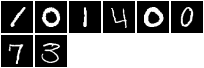
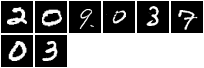
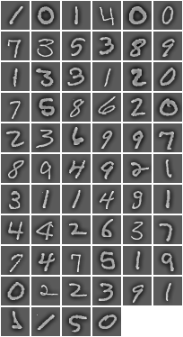
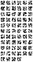
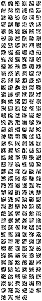

# Kaggle - MNIST Digit Recognizer

The goal in this competition is to take an image of a handwritten single digit, and determine what that digit is.

The code heavily used the [Supervised Torch7 Tutorial](https://github.com/torch/tutorials/tree/master/2_supervised) by **Clement Farabet**, several thanks to him are in order.

In the Kaggle competition, CNN got the following results:
* 10 training loops got 99.286% for a 148th poistion
* 20 training loops got 99.414% for a 114th poistion
* 40 training loops got 99.429% for a 113th position

The project demonstrates how to:
* Load and preprocess the data, to facilitate learning
* Describe a CNN model to solve a classification task
* Choose a loss function to minimize error
* Apply an optimization techniques to train the model's parameters
* Estimate the model's performance on unseen verification data

Resources:
- [Classify handwritten digits using the famous MNIST data](https://www.kaggle.com/c/digit-recognizer)
- [Machine Learning with Torch7 (Code)](https://github.com/torch/tutorials)


```lua
----------------------------------------------------------------------
-- This script demonstrates how to load the MNIST digits 
-- training data, and pre-process it to facilitate learning.
--
-- The MNIST is a typical example of supervised training dataset.
-- The problem to solve is a 10-class classification problem.
--
-- Sameh Awaida
----------------------------------------------------------------------
require 'torch'   -- torch
require 'image'   -- for color transforms
require 'nn'      -- provides a normalization operator
require 'paths'   -- checking if file exists
require 'xlua'    -- xlua provides useful tools, like progress bars
require 'optim'   -- an optimization package, for online and batch methods
require 'csvigo'  -- a package to handle CSV files (read and write)

----------------------------------------------------------------------
opt = {}
print '==> processing options'
print('opt.size: how many samples do we load: (small) (10k training, 2k testing) | full (42k training, 28k testing)')
print('opt.visualize: visualize input data and weights during training: (true) | false')
print('opt.seed: fixed input seed for repeatable experiments: (1)')
print('opt.threads: number of threads: (8)')
print('opt.model: type of model to construct: linear | mlp | (convnet)')
print('opt.loss: type of loss function to minimize: (nll) | mse | margin')
print('opt.save: subdirectory to save/log experiments in: (itorch_output)')
print('opt.plot: live plot: (true) | false')
print('opt.optimization: optimization method: (SGD) | ASGD | CG | LBFGS')
print('opt.learningRate: learning rate at t=0: (1e-3)')
print('opt.batchSize: mini-batch size (1 = pure stochastic): (1)')
print('opt.weightDecay: weight decay (SGD only): (0)')
print('opt.momentum: momentum (SGD only): (0)')
print('opt.t0: start averaging at t0 (ASGD only), in nb of epochs: (1)')
print('opt.maxIter: maximum nb of iterations for CG and LBFGS: (2)')
print('opt.type: (double) | float | cuda')

opt.size = 'full'
opt.visualize = true
opt.seed = 1
opt.threads = 8
opt.model = 'convnet'
opt.loss = 'nll'
opt.save = './itorch_output'
opt.plot = true
opt.optimization = 'SGD'
opt.learningRate = 1e-3
opt.batchSize = 1
opt.weightDecay = 0
opt.momentum = 0
opt.t0 = 1
opt.maxIter = 2
opt.type = 'double'

print(opt)

-- nb of threads and fixed seed (for repeatable experiments)
if opt.type == 'float' then
   print('==> switching to floats')
   torch.setdefaulttensortype('torch.FloatTensor')
elseif opt.type == 'cuda' then
   print('==> switching to CUDA')
   require 'cunn'
   torch.setdefaulttensortype('torch.FloatTensor')
end
torch.setnumthreads(opt.threads)
torch.manualSeed(opt.seed)
```


    ==> processing options	
    opt.size: how many samples do we load: (small) (10k training, 2k testing) | full (42k training, 28k testing)	
    opt.visualize: visualize input data and weights during training: (true) | false	
    opt.seed: fixed input seed for repeatable experiments: (1)	
    opt.threads: number of threads: (8)	
    opt.model: type of model to construct: linear | mlp | (convnet)	
    opt.loss: type of loss function to minimize: (nll) | mse | margin	
    opt.save: subdirectory to save/log experiments in: (itorch_output)	
    opt.plot: live plot: (true) | false	
    opt.optimization: optimization method: (SGD) | ASGD | CG | LBFGS	
    opt.learningRate: learning rate at t=0: (1e-3)	
    opt.batchSize: mini-batch size (1 = pure stochastic): (1)	
    opt.weightDecay: weight decay (SGD only): (0)	
    opt.momentum: momentum (SGD only): (0)	
    opt.t0: start averaging at t0 (ASGD only), in nb of epochs: (1)	
    opt.maxIter: maximum nb of iterations for CG and LBFGS: (2)	
    opt.type: (double) | float | cuda	
    {
      weightDecay : 0
      maxIter : 2
      seed : 1
      momentum : 0
      t0 : 1
      loss : nll
      type : double
      batchSize : 1
      visualize : true
      learningRate : 0.001
      threads : 8
      plot : true
      save : ./itorch_output
      size : full
      optimization : SGD
      model : convnet
    }


## Step 1: Data

The data for this competition were taken from the [MNIST dataset](http://yann.lecun.com/exdb/mnist/index.html). The MNIST ("Modified National Institute of Standards and Technology") dataset is a classic within the Machine Learning community that has been extensively studied.

Each image is 28 pixels in height and 28 pixels in width, for a total of 784 pixels in total. Each pixel has a single pixel-value associated with it, indicating the lightness or darkness of that pixel, with higher numbers meaning darker. This pixel-value is an integer between 0 and 255, inclusive.

The training data set, (train.csv), has 785 columns. The first column, called "label", is the digit that was drawn by the user. The rest of the columns contain the pixel-values of the associated image.

Each pixel column in the training set has a name like pixelx, where x is an integer between 0 and 783, inclusive. To locate this pixel on the image, suppose that we have decomposed x as x = i * 28 + j, where i and j are integers between 0 and 27, inclusive. Then pixelx is located on row i and column j of a 28 x 28 matrix, (indexing by zero).

The test data set, (test.csv), is the same as the training set, except that it does not contain the "label" column.

Overview of the dataset:

- 10 classes, 1 for each digit. Digit '1' has label 1, '9' has label 9 and '0' has label 0.
- 42000 digits for training, 28000 digits for testing.
- The inputs (images) are 1x28x28 centered around a single digit.
- The outputs (targets) are 10-dimensional


```lua
print '==> downloading dataset'

-- Here we download dataset files. 

-- Note: files were converted from their original Matlab format
-- to Torch's internal format using the mattorch package. The
-- mattorch package allows 1-to-1 conversion between Torch and Matlab
-- files.

-- The MNIST dataset contains 2 files:
--    + train: training data
--    + test:  test data
classes = {'0', '1', '2', '3', '4', '5', '6', '7', '8', '9'}
torch_file_train = 'input/train_32x32.t7'
torch_file_test = 'input/test_32x32.t7'
csv_file_train = 'input/train.csv'
csv_file_test = 'input/test.csv'

-- Save training tensor variable
if (not paths.filep(torch_file_train)) then
    if (not paths.filep(csv_file_train)) then
        os.execute('wget https://www.kaggle.com/c/digit-recognizer/download/train.csv')
    end
    local trainSetOriginal = csvigo.load{path=csv_file_train, mode='raw'}
    local nTrainingSamples = #trainSetOriginal - 1
    local trainFeatures32x32 = torch.Tensor(nTrainingSamples, 1, 32, 32)
    local trainLabels = torch.Tensor(nTrainingSamples):zero()
    for i = 1, nTrainingSamples do
        local labelSample = table.remove(trainSetOriginal[i + 1], 1)
        local featuresSample = torch.Tensor(trainSetOriginal[i + 1]):reshape(1, 28, 28)
        trainFeatures32x32[i]:narrow(2, 3, 28):narrow(3, 3, 28):copy(featuresSample)
        trainLabels[i] = labelSample + 1
    end
    torch.save(torch_file_train, {trainFeatures32x32, trainLabels})
end

-- Save testing tensor variable
if (not paths.filep(torch_file_test)) then
    if (not paths.filep(csv_file_test)) then
        os.execute('wget https://www.kaggle.com/c/digit-recognizer/download/test.csv')
    end
    local testSetOriginal = csvigo.load{path=csv_file_test, mode='raw'}
    local nTestSamples = #testSetOriginal - 1
    local testFeatures32x32 = torch.Tensor(nTestSamples, 1, 32, 32)
    for i = 1, nTestSamples do
        local featuresSample = torch.Tensor(testSetOriginal[i + 1]):reshape(1, 28, 28)
        testFeatures32x32[i]:narrow(2, 3, 28):narrow(3, 3, 28):copy(featuresSample)
    end
    torch.save(torch_file_test, testFeatures32x32)
end


----------------------------------------------------------------------
print '==> loading dataset'


if (opt.size == 'small') then
    train_size = 10000
    test_size = 2000
    print 'Using small dataset'
elseif (opt.size == 'full') then
    train_size = 42000
    test_size = 28000  
    print 'Using full dataset'
end

-- Load the training dataset
raw_data = torch.load(torch_file_train)
trainSet = {
    data = raw_data[1],
    labels = raw_data[2],
    size = function() return train_size end
}

-- Load the testing dataset
raw_data = torch.load(torch_file_test)
testSet = {
    data = raw_data,
    size = function() return test_size end
}

-- Print sample of training and testing set
if opt.visualize then
    if itorch then
        print 'Print samples of training dataset'
        first8TrainingSamples = trainSet.data[{ {1,8},{1},{},{}}]
        itorch.image(first8TrainingSamples)
        print(trainSet.labels[{{1,8}}])
        print 'Print samples of testing dataset'
        first8TestSamples = testSet.data[{ {1,8},{1},{},{}}]
        itorch.image(first8TestSamples)
    else print("For visualization, run this script in an itorch notebook") 
    end
end

```


    ==> downloading dataset	
    ==> loading dataset	
    Using full dataset	


    Print samples of training dataset	





     2
     1
     2
     5
     1
     1
     8
     4
    [torch.DoubleTensor of size 8]
    
    Print samples of testing dataset	





```lua
----------------------------------------------------------------------
print '==> preprocessing data'

-- Preprocessing requires a floating point representation (the original
-- data is stored on bytes). Types can be easily converted in Torch, 
-- in general by doing: dst = src:type('torch.TypeTensor'), 
-- where Type=='Float','Double','Byte','Int',... Shortcuts are provided
-- for simplicity (float(),double(),cuda(),...):

trainSet.data = trainSet.data:float()
testSet.data = testSet.data:float()

-- We now preprocess the data. Preprocessing is crucial
-- when applying pretty much any kind of machine learning algorithm.
-- color channels are normalized globally, across the entire dataset;
-- as a result, each color component has 0-mean and 1-norm across the dataset.


-- Normalize each channel, and store mean/std
-- per channel. These values are important, as they are part of
-- the trainable parameters. At test time, test data will be normalized
-- using these values.
print '==> preprocessing data: normalize each feature (channel) globally'
-- normalize each channel globally:
mean = trainSet.data[{ {},{1},{},{} }]:mean() -- mean estimation
print('Channel 1 mean: ' .. mean)
trainSet.data[{ {},{1},{},{} }]:add(-mean) -- mean subtraction
testSet.data[{ {},{1},{},{} }]:add(-mean) -- mean subtraction
    
stdv = trainSet.data[{ {},{1},{},{} }]:std() -- std estimation
print('Channel 1 Standard Deviation: ' .. stdv)
trainSet.data[{ {},{1},{},{} }]:div(stdv) -- std division
testSet.data[{ {},{1},{},{} }]:div(stdv) -- std division

-- Local normalization
print '==> preprocessing data: normalize each channel locally'

-- Define the normalization neighborhood:
neighborhood = image.gaussian1D(13)

-- Define our local normalization operator (It is an actual nn module,
-- which could be inserted into a trainable model):
normalization = nn.SpatialContrastiveNormalization(1, neighborhood,1):float()

-- Normalize all channels locally:
for i = 1,trainSet:size() do
    trainSet.data[{ {i},{1},{},{} }] = normalization:forward(trainSet.data[{ {i},{1},{},{} }])
end
for i = 1,testSet:size() do
    testSet.data[{ {i},{1},{},{} }] = normalization:forward(testSet.data[{ {i},{1},{},{} }])
end


----------------------------------------------------------------------
```


    ==> preprocessing data	


    ==> preprocessing data: normalize each feature (channel) globally	


    Channel 1 mean: 25.578697614397	


    Channel 1 Standard Deviation: 70.282630863225	


    ==> preprocessing data: normalize each channel locally	


```lua
print '==> verify statistics'
-- It's always good practice to verify that data is properly normalized


print('Training Set Channel 1 mean: ' .. trainSet.data[{ {},{1},{},{} }]:mean())
print('Testing Set Channel 1 mean: ' .. testSet.data[{ {},{1},{},{} }]:mean())
print('Training Set Channel 1 Standard Deviation: ' .. trainSet.data[{ {},{1},{},{} }]:std())
print('Testing Set Channel 1 Standard Deviation: ' .. testSet.data[{ {},{1},{},{} }]:std())

----------------------------------------------------------------------
print '==> visualizing data'
-- Visualization is quite easy, using itorch.image().

if opt.visualize then
    if itorch then
        first64samples = trainSet.data[{ {1,64},{1},{},{}}]
        itorch.image(first64samples)
    else print("For visualization, run this script in an itorch notebook") 
    end
end
```


    ==> verify statistics	


    Training Set Channel 1 mean: -0.030610727006601	


    Testing Set Channel 1 mean: -0.030535941123171	


    Training Set Channel 1 Standard Deviation: 0.58335232858409	


    Testing Set Channel 1 Standard Deviation: 0.58278465218005	
    ==> visualizing data	





## Step 2: Model Definition

In this file, we describe three different models: convolutional neural networks (CNNs, or ConvNets), multi-layer neural networks (MLPs), and a simple linear model (which becomes a logistic regression if used with a negative log-likelihood loss).

Linear regression is the simplest type of model. It is parametrized by a weight matrix W, and a bias vector b. Mathematically, it can be written as:
$$ y^n = Wx^n+b $$

Using the nn package, describing ConvNets, MLPs and other forms of sequential trainable models is really easy. All we have to do is create a top-level wrapper, which, as for the logistic regression, is going to be a sequential module, and then append modules into it. Implementing a simple linear model is therefore trivial:
```torch
model = nn.Sequential()
model:add(nn.Reshape(ninputs))
model:add(nn.Linear(ninputs, noutputs))
```

A slightly more complicated model is the multi-layer neural network (MLP). This model is parametrized by two weight matrices, and two bias vectors:
$$ y^n = W_2 \text{sigmoid}(W_1 x^n + b_1) + b_2 $$

where the function sigmoid is typically the symmetric hyperbolic tangent function. Again, in Torch:
```torch
model = nn.Sequential()
model:add(nn.Reshape(ninputs))
model:add(nn.Linear(ninputs,nhiddens))
model:add(nn.Tanh())
model:add(nn.Linear(nhiddens,noutputs))
```

Compared to the linear regression model, the 2-layer neural network can learn arbitrary non-linear mappings between its inputs and outputs. In practice, it can be quite hard to train fully-connected MLPs to classify natural images.

Convolutional Networks are a particular form of MLP, which was tailored to efficiently learn to classify images. Convolutional Networks are trainable architectures composed of multiple stages. The input and output of each stage are sets of arrays called feature maps. For example, if the input is a color image, each feature map would be a 2D array containing a color channel of the input image (for an audio input each feature map would be a 1D array, and for a video or volumetric image, it would be a 3D array). At the output, each feature map represents a particular feature extracted at all locations on the input. 

Each stage is composed of three layers: a **filter bank layer**, a **non-linearity layer**, and a **feature pooling layer**. A typical ConvNet is composed of one, two or three such 3-layer stages, followed by a **classification module**. Each layer type is now described for the case of image recognition.


Trainable hierarchical vision models, and more generally image processing algorithms are usually expressed as sequences of operations or transformations. They can be well described by a modular approach, in which each module processes an input image bank and produces a new bank. The figure above is a nice graphical illustration of this approach. Each module requires the previous bank to be fully (or at least partially) available before computing its output. This causality prevents simple parallelism to be implemented across modules. However parallelism can easily be introduced within a module, and at several levels, depending on the kind of underlying operations. These forms of parallelism are exploited in Torch7.

Typical ConvNets rely on a few basic modules:
* **Filter bank layer**: the input is a 3D array with n1 2D feature maps of size n2 x n3. Each component is denoted $x_{ijk}$, and each feature map is denoted xi. The output is also a 3D array, y composed of m1 feature maps of size m2 x m3. A trainable filter (kernel) $k_{ij}$ in the filter bank has size l1 x l2 and connects input feature map x to output feature map $y_j$. The module computes $y_j = b_j + i_{kij} * x_i$ where $*$ is the 2D discrete convolution operator and $b_j$ is a trainable bias parameter. Each filter detects a particular feature at every location on the input. Hence spatially translating the input of a feature detection layer will translate the output but leave it otherwise unchanged.
* **Non-Linearity Layer**: In traditional ConvNets this simply consists in a pointwise tanh() sigmoid function applied to each site (ijk). However, recent implementations have used more sophisticated non-linearities. A useful one for natural image recognition is the rectified sigmoid Rabs: $|g_i.tanh()|$ where $g_i$ is a trainable gain parameter. The rectified sigmoid is sometimes followed by a subtractive and divisive local normalization N, which enforces local competition between adjacent features in a feature map, and between features at the same spatial location.
* **Feature Pooling Layer**: This layer treats each feature map separately. In its simplest instance, it computes the average values over a neighborhood in each feature map. Recent work has shown that more selective poolings, based on the LP-norm, tend to work best, with P=2, or P=inf (also known as max pooling). The neighborhoods are stepped by a stride larger than 1 (but smaller than or equal the pooling neighborhood). This results in a reduced-resolution output feature map which is robust to small variations in the location of features in the previous layer. The average operation is sometimes replaced by a max PM. Traditional ConvNets use a pointwise tanh() after the pooling layer, but more recent models do not. Some ConvNets dispense with the separate pooling layer entirely, but use strides larger than one in the filter bank layer to reduce the resolution. In some recent versions of ConvNets, the pooling also pools similar feature at the same location, in addition to the same feature at nearby locations.

A couple of comments about the model that we are going to use:
* the input has 3 feature maps, each 32x32 pixels. It is the convention for all nn.Spatial* layers to work on 3D arrays, with the first dimension indexing different features (here normalized YUV), and the next two dimensions indexing the height and width of the image/map.
* the fist layer applies 16 filters to the input map, each being 5x5. The receptive field of this first layer is 5x5, and the maps produced by it are therefore 16x28x28. This linear transform is then followed by a non-linearity (tanh), and an L2-pooling function, which pools regions of size 2x2, and uses a stride of 2x2. The result of that operation is a 16x14x14 array, which represents a 14x14 map of 16-dimensional feature vectors. The receptive field of each unit at this stage is 7x7.
* the second layer is very much analogous to the first, except that now the 16-dim feature maps are projected into 256- dim maps, with a fully-connected connection table: each unit in the output array is influenced by a 4x5x5 neighborhood of features in the previous layer. That layer has therefore 4x256x5x5 trainable kernel weights (and 256 biases). The result of the complete layer (conv+pooling) is a 256x5x5 array.
* at this stage, the 5x5 array of 256-dimensional feature vectors is flattened into a 6400-dimensional vector, which we feed to a two-layer neural net. The final prediction (10-dimensional distribution over classes) is influenced by a 32x32 neighborhood of input variables (YUV pixels).
* recent work (Jarret et al.) has demonstrated the advantage of locally normalizing sets of internal features, at each stage of the model. The use of smoother pooling functions, such as the L2 norm for instance instead of the harsher max-pooling, has also been shown to yield better generalization (Sermanet et al.). We use these two ingredients in this model.
* one other remark: it is typically not a good idea to use fully connected layers, in internal layers. In general, favoring large numbers of features (over-completeness) over density of connections helps achieve better results (empirical evidence of this was reported in several papers, as in Hadsell et al.). The SpatialConvolutionMap module accepts tables of connectivities (maps) that allows one to create arbitrarily sparse connections between two layers. A couple of standard maps/tables are provided in nn.tables.


```lua
-- This script demonstrates how to define a couple of different
-- models:
--   + linear
--   + 2-layer neural network (MLP)
--   + convolutional network (ConvNet)
----------------------------------------------------------------------

print '==> define parameters'

-- 10 class problem
noutputs = 10

-- input dimensions
nfeats = 1
width = 32
height = 32
ninputs = nfeats * width * height

-- number of hidden units (for MLP only):
nhiddens = ninputs / 2

-- hidden units, filter size (for ConvNets only):
nstates = {64,64,128}
fanin = {1,4}
filtsize = 5
poolsize = 2
normkernel = image.gaussian1D(7)

----------------------------------------------------------------------
print '==> construct model'
if opt.model == 'linear' then
    -- Simple linear model
    model = nn.Sequential()
    model:add(nn.Reshape(ninputs))
    model:add(nn.Linear(ninputs, noutputs))
    
elseif opt.model == 'mlp' then
    -- Simple 2-layer neural network, with tanh hidden units
    model = nn.Sequential()
    model:add(nn.Reshape(ninputs))
    model:add(nn.Linear(ninputs, nhiddens))
    model:add(nn.Tanh())
    model:add(nn.Linear(nhiddens, noutputs))

elseif opt.model == 'convnet' then
    if opt.type == 'cuda' then
        -- a typical modern convolution network (conv+relu+pool)
        model = nn.Sequential()
        
        -- stage 1 : filter bank -> squashing -> L2 pooling -> normalization
        model:add(nn.SpatialConvolutionMM(nfeats, nstates[1], filtsize, filtsize))
        model:add(nn.ReLU())
        model:add(nn.SpatialMaxPooling(poolsize,poolsize,poolsize,poolsize))
        
        -- stage 2 : filter bank -> squashing -> L2 pooling -> normalization
        model:add(nn.SpatialConvolutionMM(nstates[1], nstates[2], filtsize, filtsize))
        model:add(nn.ReLU())
        model:add(nn.SpatialMaxPooling(poolsize,poolsize,poolsize,poolsize))
        
        -- stage 3 : standard 2-layer neural network
        model:add(nn.View(nstates[2]*filtsize*filtsize))
        model:add(nn.Dropout(0.5))
        model:add(nn.Linear(nstates[2]*filtsize*filtsize, nstates[3]))
        model:add(nn.ReLU())
        model:add(nn.Linear(nstates[3], noutputs))
        
    else 
        -- a typical convolutional network, with locally-normalized hidden
        -- units, and L2-pooling
        -- Note: the architecture of this convnet is loosely based on Pierre Sermanet's
        -- work on this dataset (http://arxiv.org/abs/1204.3968). In particular
        -- the use of LP-pooling (with P=2) has a very positive impact on
        -- generalization. Normalization is not done exactly as proposed in
        -- the paper, and low-level (first layer) features are not fed to
        -- the classifier.
        model = nn.Sequential()
        
        -- stage 1 : filter bank -> squashing -> L2 pooling -> normalization
        model:add(nn.SpatialConvolutionMap(nn.tables.random(nfeats, nstates[1], fanin[1]), filtsize, filtsize))
        model:add(nn.Tanh())
        model:add(nn.SpatialLPPooling(nstates[1], 2, poolsize, poolsize, poolsize, poolsize))
        model:add(nn.SpatialSubtractiveNormalization(nstates[1],normkernel))
        
        -- stage 2 : filter bank -> squashing -> L2 pooling -> normalization
        model:add(nn.SpatialConvolutionMap(nn.tables.random(nstates[1], nstates[2], fanin[2]), filtsize, filtsize))
        model:add(nn.Tanh())
        model:add(nn.SpatialLPPooling(nstates[2], 2, poolsize, poolsize, poolsize, poolsize))
        model:add(nn.SpatialSubtractiveNormalization(nstates[2],normkernel))
        
        -- stage 3 : standard 2-layer neural network
        model:add(nn.Reshape(nstates[2]*filtsize*filtsize))
        model:add(nn.Linear(nstates[2]*filtsize*filtsize, nstates[3]))
        model:add(nn.Tanh())
        model:add(nn.Linear(nstates[3], noutputs))
    end
else
    print('unknown -model')
end

----------------------------------------------------------------------
print '==> here is the model:'
print(model)

----------------------------------------------------------------------
-- Visualization is quite easy, using itorch.image().
if opt.visualize == true then
    if itorch then
        print('==> visualizing ConvNet filters')
        if opt.model == 'linear' then
            print('Linear Layer 1 filters:')
            itorch.image(model.modules[2].weight)
        elseif opt.model == 'mlp' then
            print('MLP Layer 1 filters:')
            itorch.image(model.modules[2].weight)
        elseif opt.model == 'convnet' then
            if opt.type == 'cuda' then
                print('CUDA Convnet Layer 1 filters:')
                itorch.image(model.modules[1].weight)
                print('CUDA Convnet Layer 2 filters:')
                itorch.image(model.modules[4].weight)
            else
                print('Normal Convnet Layer 1 filters:')
                itorch.image(model.modules[1].weight)
                print('Normal Convnet Layer 2 filters:')
                itorch.image(model.modules[5].weight)
            end
        else error('Wrong NN Model') end
    else print('For visualization, run this script in an itorch notebook') 
    end
end
```


    ==> define parameters	
    ==> construct model	


    ==> here is the model:	
    nn.Sequential {
      [input -> (1) -> (2) -> (3) -> (4) -> (5) -> (6) -> (7) -> (8) -> (9) -> (10) -> (11) -> (12) -> output]
      (1): nn.SpatialConvolutionMap
      (2): nn.Tanh
      (3): nn.Sequential {
        [input -> (1) -> (2) -> (3) -> (4) -> output]
        (1): nn.Square
        (2): nn.SpatialAveragePooling(2x2, 2,2)
        (3): nn.MulConstant
        (4): nn.Sqrt
      }
      (4): nn.SpatialSubtractiveNormalization
      (5): nn.SpatialConvolutionMap
      (6): nn.Tanh
      (7): nn.Sequential {
        [input -> (1) -> (2) -> (3) -> (4) -> output]
        (1): nn.Square
        (2): nn.SpatialAveragePooling(2x2, 2,2)
        (3): nn.MulConstant
        (4): nn.Sqrt
      }
      (8): nn.SpatialSubtractiveNormalization
      (9): nn.Reshape(1600)
      (10): nn.Linear(1600 -> 128)
      (11): nn.Tanh
      (12): nn.Linear(128 -> 10)
    }
    {
      gradInput : DoubleTensor - empty
      modules : 
        {
          1 : 
            nn.SpatialConvolutionMap
            {
              dH : 1
              dW : 1
              nInputPlane : 1
              kW : 5
              gradInput : DoubleTensor - empty
              


    connTable : DoubleTensor - size: 64x2
              gradBias : DoubleTensor - size: 64
              weight : DoubleTensor - size: 64x5x5
              _type : torch.DoubleTensor
              gradWeight : DoubleTensor - size: 64x5x5
              bias : DoubleTensor - size: 64
              nOutputPlane : 64
              output : DoubleTensor - empty
              kH : 5
            }
          2 : 
            nn.Tanh
            {
              gradInput : DoubleTensor - empty
              _type : torch.DoubleTensor
              


    output : DoubleTensor - empty
            }
          3 : 
            nn.Sequential {
              [input -> (1) -> (2) -> (3) -> (4) -> output]
              (1): nn.Square
              (2): nn.SpatialAveragePooling(2x2, 2,2)
              (3): nn.MulConstant
              (4): nn.Sqrt
            }
            {
              dH : 2
              dW : 2
              _type : torch.DoubleTensor
              output : DoubleTensor - empty
              gradInput : DoubleTensor - empty
              modules : 
                {
                  1 : 
                    nn.Square
                    {
                      gradInput : DoubleTensor - empty
                      _type : torch.DoubleTensor
                      output : DoubleTensor - empty
                    }
                  2 : 
                    nn.SpatialAveragePooling(2x2, 2,2)
                    {
                      dH : 2
                      dW : 2
                      kW : 2
                      gradInput : DoubleTensor - empty
                      divide : true
                      count_include_pad : true
                      _type : torch.DoubleTensor
                      padH : 0
                      ceil_mode : false
                      output : DoubleTensor - empty
                      kH : 2
                      padW : 0
                    }
                  3 : 
                    nn.MulConstant
                    {
                      inplace : false
                      _type : torch.DoubleTensor
                      constant_scalar : 4
                      gradInput : DoubleTensor - empty
                      output : DoubleTensor - empty
                    }
                  4 : 
                    nn.Sqrt
                    {
          


                gradInput : DoubleTensor - empty
                      eps : 0
                      _type : torch.DoubleTensor
                      output : DoubleTensor - empty
                    }
                }
              kH : 2
              kW : 2
            }
          4 : 
            nn.SpatialSubtractiveNormalization
            {
              nInputPlane : 64
              divider : 
                nn.CDivTable
                {
                  gradInput : table: 0x3eaf5070
                  _type : torch.DoubleTensor
                  output : DoubleTensor - empty
                }
              gradInput : DoubleTensor - empty
              coef : DoubleTensor - size: 1x1x1
              kernel : DoubleTensor - size: 7
              _type : torch.DoubleTensor
              subtractor : 
                nn.CSubTable
                {
                  gradInput : table: 0x3eaf3c38
                  _type : torch.DoubleTensor
                  output : DoubleTensor - empty
                }
              meanestimator : 
                nn.Sequential {
                  [input -> (1) -> (2) -> (3) -> (4) -> output]
                  (1): nn.SpatialZeroPadding(l=3, r=3, t=3, b=3)
                  (2): nn.SpatialConvolutionMap
                  (3): nn.SpatialConvolution(64 -> 1, 1x7)
                  (4): nn.Replicate
                }
                {
                  gradInput : DoubleTensor - empty
                  modules : 
                    {
                      1 : nn.SpatialZeroPadding(l=3, r=3, t=3, b=3)
                      2 : nn.SpatialConvolutionMap
                      3 : nn.SpatialConvolution(64 -> 1, 1x7)
                      4 : nn.Replicate
                    }
                  _type : torch.DoubleTensor
                  output : DoubleTensor - empty
                }
              output : DoubleTensor - empty
            }
          5 : 
            nn.SpatialConvolutionMap
            {


              dH : 1
              dW : 1
              nInputPlane : 64
              kW : 5
              gradInput : DoubleTensor - empty
              connTable : DoubleTensor - size: 256x2
              gradBias : DoubleTensor - size: 64
              weight : DoubleTensor - size: 256x5x5
              _type : torch.DoubleTensor
              gradWeight : DoubleTensor - size: 256x5x5
              bias : DoubleTensor - size: 64
              nOutputPlane : 64
              output : DoubleTensor - empty
              kH : 5
            }
          6 : 
            nn.Tanh
            {
              gradInput : DoubleTensor - empty
              _type : torch.DoubleTensor
              output : DoubleTensor - empty
            }
          7 : 
            nn.Sequential {
              [input -> (1) -> (2) -> (3) -> (4) -> output]
              (1): nn.Square
              (2): nn.SpatialAveragePooling(2x2, 2,2)
              (3): nn.MulConstant
              (4): nn.Sqrt
            }
            {
              dH : 2
              dW : 2
             


     _type : torch.DoubleTensor
              output : DoubleTensor - empty
              gradInput : DoubleTensor - empty
              modules : 
                {
                  1 : 
                    


    nn.Square
                    


    {
                      gradInput : DoubleTensor - empty
                      _type : torch.DoubleTensor
                      output : DoubleTensor - empty
                    }
                  2 : 
                    nn.SpatialAveragePooling(2x2, 2,2)
                    {
                      dH : 2
                      dW : 2
                      kW : 2
                      gradInput : DoubleTensor - empty
                      divide : true
                      count_include_pad : true
                      _type : torch.DoubleTensor
                      padH : 0
                      ceil_mode : false
                      output : DoubleTensor - empty
                      kH : 2
                      padW : 0
                    }
                  3 : 
                    nn.MulConstant
                    {
                      inplace : false
                      _type : torch.DoubleTensor
                      constant_scalar : 4
                      gradInput : DoubleTensor - empty
                      output : DoubleTensor - empty
                    }
                  4 : 
                    nn.Sqrt
                    {
                      gradInput : DoubleTensor - empty
                      eps : 0
                      _type : torch.DoubleTensor
                      output : DoubleTensor - empty
                    }
                }
              kH : 2
              kW : 2
            }
          8 : 
            nn.SpatialSubtractiveNormalization
            {
              nInputPlane : 64
              divider : 
                nn.CDivTable
                {
                  gradInput : table: 0x3f4d0288
                  _type : torch.DoubleTensor
                  output : DoubleTensor - empty
                }
              gradInput : DoubleTensor - empty
              coef : DoubleTensor - size: 1x1x1
              kernel : DoubleTensor - size: 7
              _type : torch.DoubleTensor
     


             subtractor : 
                nn.CSubTable
                {
                  gradInput : table: 0x3f4d1448
                  _type : torch.DoubleTensor
                  output : DoubleTensor - empty
                }
              meanestimator : 
                nn.Sequential {
                  [input -> (1) -> (2) -> (3) -> (4) -> output]
                  (1): nn.SpatialZeroPadding(l=3, r=3, t=3, b=3)
                  (2): nn.SpatialConvolutionMap
                  (3): nn.SpatialConvolution(64 -> 1, 1x7)
                  (4): nn.Replicate
                }
                {
                  gradInput : DoubleTensor - empty
                  modules : 
                    {
                      1 : nn.SpatialZeroPadding(l=3, r=3, t=3, b=3)


                      2 : nn.SpatialConvolutionMap
                      3 : nn.SpatialConvolution(64 -> 1, 1x7)
                      4 : nn.Replicate
                    }
                  _type : torch.DoubleTensor
                  output : DoubleTensor - empty
                }
              output : DoubleTensor - empty
            }
          9 : 
            nn.Reshape(1600)
            {
              _type : torch.DoubleTensor
              output : DoubleTensor - empty
              gradInput : DoubleTensor - empty
              size : LongStorage - size: 1
              nelement : 1600
              batchsize : LongStorage - size: 2
            }
          10 : 
            nn.Linear(1600 -> 128)
            {
              gradBias : DoubleTensor - size: 128
              weight : DoubleTensor - size: 128x1600
              _type : torch.DoubleTensor
              output : DoubleTensor - empty
              gradInput : DoubleTensor - empty
              bias : DoubleTensor - size: 128
              gradWeight : DoubleTensor - size: 128x1600
            }
          11 : 
            nn.Tanh
            {
              gradInput : DoubleTensor - empty
              _type : torch.DoubleTensor
              output : DoubleTensor - empty
            }
          12 : 
            nn.Linear(128 -> 10)
            {
              


    gradBias : DoubleTensor - size: 10
              weight : DoubleTensor - size: 10x128
              _type : torch.DoubleTensor
              output : DoubleTensor - empty
              gradInput : DoubleTensor - empty
              bias : DoubleTensor - size: 10
              gradWeight : DoubleTensor - size: 10x128
            }
        }
      _type : torch.DoubleTensor
      output : DoubleTensor - empty
    }
    ==> visualizing ConvNet filters	
    Normal Convnet Layer 1 filters:	





    Normal Convnet Layer 2 filters:	





## Step 3: Loss Function

Now that we have a model, we need to define a loss function to be minimized, across the entire training set:

$$ L = \sum_n l(y^n,t^n) $$

One of the simplest loss functions we can minimize is the **mean-square error** between the predictions (outputs of the model), and the groundtruth labels, across the entire dataset:

$$ l(y^n,t^n) = \frac{1}{2} \sum_i (y_i^n - t_i^n)^2 $$

or, in Torch:
```torch
criterion = nn.MSECriterion()
```

The MSE loss is typically not a good one for classification, as it forces the model to exactly predict the values imposed by the targets (labels).

Instead, a more commonly used, probabilistic objective is the **negative log-likelihood**. To minimize a negative log-likelihood, we first need to turn the predictions of our models into properly normalized log-probabilities. For the linear model, this is achieved by feeding the output units into a softmax function, which turns the linear regression into a logistic regression:

$$ P(Y=i|x^n,W,b) = \text{softmax}(Wx^n+be) $$ 
$$ P(Y=i|x^n,W,b) = \frac{ e^{Wx_i^n+b} }{ \sum_j e^{Wx_j^n+b} } $$

As we're interested in classification, the final prediction is then achieved by taking the argmax of this distribution:

$$ y^n = \arg\max_i P(Y=i|x^n,W,b) $$

in which case the ouput y is a scalar.

More generally, the output of any model can be turned into normalized log-probabilities, by stacking a softmax function on top. So given any of the models defined above, we can simply do:
```torch
model:add( nn.LogSoftMax() )
```

We want to maximize the likelihood of the correct (target) class, for each sample in the dataset. This is equivalent to minimizing the **negative log-likelihood (NLL)**, or minimizing the cross-entropy between the predictions of our model and the targets (training data). Mathematically, the per-sample loss can be defined as:

$$ l(x^n,t^n) = -\log(P(Y=t^n|x^n,W,b)) $$

Given that our model already produces log-probabilities (thanks to the softmax), the loss is quite straightforward to estimate. In Torch, we use the ClassNLLCriterion, which expects its input as being a vector of log-probabilities, and the target as being an integer pointing to the correct class:
```torch
criterion = nn.ClassNLLCriterion()
```

Finally, another type of classification loss is the **multi-class margin loss**, which is closer to the well-known SVM loss. This loss function doesn't require normalized outputs, and can be implemented like this:
```torch
criterion = nn.MultiMarginCriterion()
```

The margin loss typically works on par with the negative log-likelihood. I haven't tested this thoroughly, so it's time for more exercises.


```lua
----------------------------------------------------------------------
-- This script demonstrates how to define a couple of different
-- loss functions:
--   + negative-log likelihood, using log-normalized output units (SoftMax)
--   + mean-square error
--   + margin loss (SVM-like)
----------------------------------------------------------------------

print '==> define loss'

if opt.loss == 'margin' then
    -- This loss takes a vector of classes, and the index of
    -- the grountruth class as arguments. It is an SVM-like loss
    -- with a default margin of 1.
    criterion = nn.MultiMarginCriterion()

elseif opt.loss == 'nll' then
    -- This loss requires the outputs of the trainable model to
    -- be properly normalized log-probabilities, which can be
    -- achieved using a softmax function
    model:add(nn.LogSoftMax())
    
    -- The loss works like the MultiMarginCriterion: it takes
    -- a vector of classes, and the index of the grountruth class
    -- as arguments.
    criterion = nn.ClassNLLCriterion()

elseif opt.loss == 'mse' then    
    -- The mean-square error is not recommended for classification
    -- tasks, as it typically tries to do too much, by exactly modeling
    -- the 1-of-N distribution. For the sake of showing more examples,
    -- we still provide it here:
    criterion = nn.MSECriterion()
    
    -- Compared to the other losses, the MSE criterion needs a distribution
    -- as a target, instead of an index. Indeed, it is a regression loss!
    -- So we need to transform the entire label vectors:
    if trainSet then
        -- convert training labels:
        local trsize = trainSet:size()
        local trlabels = torch.Tensor(trsize, noutputs)
        trlabels:fill(-1)
        for i = 1,trsize do trlabels[{i,trainSet.labels[i]}] = 1 end
        trainSet.labels = trlabels
        
        -- convert training labels:
        local tesize = testSet:size()
        local telabels = torch.Tensor(tesize, noutputs)
        telabels:fill(-1)
        for i = 1,tesize do telabels[{i,testSet.labels[i]}] = 1 end
        testSet.labels = telabels
    end

else 
    error('error: unknown -class')
end

----------------------------------------------------------------------
print '==> here is the loss function:'
print(opt.loss)
--print(criterion)
```


    ==> define loss	
    ==> here is the loss function:	
    nll	


## Step 4: Training Procedure

We now have some training data, a model to train, and a loss function to minimize. We define a training procedure.

A very important aspect about supervised training of non-linear models (ConvNets and MLPs) is the fact that the optimization problem is not convex anymore. This reinforces the need for a stochastic estimation of gradients, which have shown to produce much better generalization results for several problems.

In this example, we show how the optimization algorithm can be easily set to either L-BFGS, CG, SGD or ASGD. In practice, it's very important to start with a few epochs of pure SGD, before switching to L-BFGS or ASGD (if switching at all). The intuition for that is related to the non-convex nature of the problem: at the very beginning of training (random initialization), the landscape might be highly non-convex, and no assumption should be made about the shape of the energy function. Often, SGD is the best we can do. Later on, batch methods (L-BFGS, CG) can be used more safely.

Interestingly, in the case of large convex problems, stochasticity is also very important, as it allows much faster (rough) convergence. Several works have explored these techniques, in particular, this recent paper from Byrd/Nocedal, and work on pure stochastic gradient descent by Bottou.

Here is our full training function, which demonstrates that you can switch the optimization you're using at runtime (if you want to), and also modify the batch size you're using at run time. You can do all these things because we create the evaluation closure each time we create a new batch. If the batch size is 1, then the method is purely stochastic. If the batch size is set to the complete dataset, then the method is a pure batch method.


```lua
----------------------------------------------------------------------
-- This script demonstrates how to define a training procedure,
-- irrespective of the model/loss functions chosen.
--
-- It shows how to:
--   + construct mini-batches on the fly
--   + define a closure to estimate (a noisy) loss
--     function, as well as its derivatives wrt the parameters of the
--     model to be trained
--   + optimize the function, according to several optmization
--     methods: SGD, L-BFGS.
----------------------------------------------------------------------

-- CUDA?
if opt.type == 'cuda' then
    model:cuda()
    criterion:cuda()
end

----------------------------------------------------------------------
print '==> defining some tools'

-- This matrix records the current confusion across classes
confusion = optim.ConfusionMatrix(classes)

-- Log results to files
trainLogger = optim.Logger(paths.concat(opt.save, 'train.log'))

-- Retrieve parameters and gradients:
-- this extracts and flattens all the trainable parameters of the mode
-- into a 1-dim vector
if model then
    parameters,gradParameters = model:getParameters()
end

----------------------------------------------------------------------
print '==> configuring optimizer'

if opt.optimization == 'CG' then
    optimState = {maxIter = opt.maxIter}
    optimMethod = optim.cg
    
elseif opt.optimization == 'LBFGS' then
    optimState = {
        learningRate = opt.learningRate,
        maxIter = opt.maxIter,
        nCorrection = 10
    }
    optimMethod = optim.lbfgs

elseif opt.optimization == 'SGD' then
    optimState = {
        learningRate = opt.learningRate,
        weightDecay = opt.weightDecay,
        momentum = opt.momentum,
        learningRateDecay = 1e-17
    }
    optimMethod = optim.sgd
    
elseif opt.optimization == 'ASGD' then
    optimState = {
        eta0 = opt.learningRate,
        t0 = train_size * opt.t0
    }
    optimMethod = optim.asgd
else error('unknown optimization method')
end

----------------------------------------------------------------------
print '==> defining training procedure'

function train()
    -- Printing training size
    print('==> Training on ' .. trainSet:size() .. ' samples')
    -- epoch tracker
    epoch = epoch or 1
    
    -- local vars
    local time = sys.clock()
    
    -- set model to training mode (for modules that differ in training and testing, like Dropout)
    model:training()
    
    -- shuffle at each epoch
    shuffle = torch.randperm(train_size)
    
    -- do one epoch
    print('==> doing epoch on training data:')
    print("==> online epoch # " .. epoch .. ' [batchSize = ' .. opt.batchSize .. ']')
    
    for t = 1,trainSet:size(), opt.batchSize do
        -- disp progress
        xlua.progress(t, trainSet:size())
        
        -- create mini batch
        local inputs = {}
        local targets = {}
        
        for i = t,math.min(t+opt.batchSize-1, trainSet:size()) do
            -- load new sample
            local input = trainSet.data[shuffle[i]]
            local target = trainSet.labels[shuffle[i]]
            
            if opt.type == 'double' then
                input = input:double()
                if opt.loss == 'mse' then target = target:double() end
            elseif opt.type == 'cuda' then
                input = input:cuda()
                if opt.loss == 'mse' then target = target:cuda() end
            end
            
            table.insert(inputs,input)
            table.insert(targets, target)
        end
        
        -- create closure to evaluate f(X) and df/dX
        local feval = function(x)
            -- get new parameters
            if x ~= parameters then parameters:copy(x) end
            
            -- reset gradients
            gradParameters:zero()
            
             -- f is the average of all criterions
            local f = 0
            
            -- evaluate function for complete mini batch
            for i = 1,#inputs do
                -- estimate f
                local output = model:forward(inputs[i])
                local err = criterion:forward(output, targets[i])
                f = f + err
                
                -- estimate df/dW
                local df_dw = criterion:backward(output, targets[i])
                model:backward(inputs[i], df_dw)
                
                -- update confusion
                confusion:add(output, targets[i])
            end
            
            -- normalize gradients and f(X)
            gradParameters:div(#inputs)
            f = f/#inputs
            
            -- return f and df/dX
            return f, gradParameters
        end
        
        -- optimize on current mini-batch
        if optimMethod == optim.asgd then _,_,average = optimMethod(feval, parameters, optimState)
        else optimMethod(feval, parameters, optimState)
        end
    end
    
    -- time taken
    time = sys.clock() - time
    time = time / trainSet:size()
    print("\n==> time to learn 1 sample = " .. (time*1000) .. 'ms')
    
    -- print confusion matrix
    print(confusion)
    
    -- update logger/plot
    trainLogger:add{['% mean class accuracy (train set)'] = confusion.totalValid * 100}
    if opt.plot then
        trainLogger:style{['% mean class accuracy (train set)'] = '-'}
        trainLogger:plot()
    end
    
    -- save/log current net
    local filename = paths.concat(opt.save, 'model.net')
    --os.execute('mkdir -p ' .. sys.dirname(filename))
    print('==> saving model to '..filename)
    torch.save(filename, model)
    
    -- next epoch
    confusion:zero()
    epoch = epoch + 1
end
```


    ==> defining some tools	


## Step 5: Test the Model

A common thing to do is to test the model's performance while we train it. Usually, this test is done on a subset of the training data, that is kept for validation. Here we simply define the test procedure on the available test set:


```lua
----------------------------------------------------------------------
-- This script implements save the test result to CSV file
----------------------------------------------------------------------

print '==> defining test procedure'

-- test function
function test()
    -- print number of testing samples
    print('==> Testing on ' .. testSet:size() .. ' samples')
    local csv_file_output = paths.concat(opt.save, 'output.csv')
    -- local vars
    local time = sys.clock()
    
    -- averaged param use?
    if average then
        cachedparams = parameters:clone()
        parameters:copy(average)
    end
    
    -- set model to evaluate mode (for modules that differ in training and testing, like Dropout)
    model:evaluate()
    
    -- test over test data
    print('==> Writing prediction to CSV file:')
    local csv_data = {}
    csv_data[1] = {'ImageId','Label'}

    for t = 1,testSet:size() do
        -- disp progress
        xlua.progress(t, testSet:size())
        
        -- get new sample
        local input = testSet.data[t]
        if opt.type == 'double' then input = input:double()
        elseif opt.type == 'cuda' then input = input:cuda() end
        
        -- test sample
        local pred = model:forward(input)
        local _, indices = torch.sort(pred, true) 
        csv_data[t+1] = {}
        csv_data[t+1][1] = t
        csv_data[t+1][2] = indices[1] - 1
    end
    
    -- timing
    time = sys.clock() - time
    time = time / testSet:size()
    print("\n==> time to test 1 sample = " .. (time*1000) .. 'ms')
    
    -- print confusion matrix
    csvigo.save{path=csv_file_output,data = csv_data}
    
    -- averaged param use?
    if average then 
        -- restore parameters
        parameters:copy(cachedparams)
    end
    
    -- next iteration:
    confusion:zero()
end
```


    ==> defining test procedure	


```lua
----------------------------------------------------------------------
print '==> training!'

for i =1,40 do
    train()
end

----------------------------------------------------------------------
print '==> testing!'
test()
```


    ==> training!	
    ==> Training on 42000 samples	


     [..............................................]                                ETA: 0ms | Step: 0ms 


    ==> doing epoch on training data:	
    ==> online epoch # 1 [batchSize = 1]	


     [=============================================>]                                Tot: 8m32s | Step: 11ms 


    
    ==> time to learn 1 sample = 12.197138547897ms	
    ConfusionMatrix:
    [[    4030      15       6      22       1      13      23       5      15       2]   97.531% 	[class: 0]
     [       3    4611      37       5       4       1       8      13       2       0]   98.442% 	[class: 1]
     [      32     101    3838      63      10       6      15      72      35       5]   91.884% 	[class: 2]
     [      19      54      31    4126       1      33       1      41      31      14]   94.829% 	[class: 3]
     [      24     108       6       7    3793       0      15      33       9      77]   93.148% 	[class: 4]
     [      26      68       1     149       1    3486      25       6      14      19]   91.858% 	[class: 5]
     [      83      67       0      10       7      18    3934       1      16       1]   95.093% 	[class: 6]
     [       7      74      47      13      14       2       0    4152       8      84]   94.342% 	[class: 7]
     [      38     131      25      89      17      24      34      29    3614      62]   88.949% 	[class: 8]
     [      39      62       3      56      45       6       1     167      31    3778]]  90.210% 	[class: 9]
     + average row correct: 93.628634810448% 
     + average rowUcol correct (VOC measure): 88.287142515182% 
     + global correct: 93.719047619048%
    {
      _mat_flat : LongTensor - size: 100
      valids : FloatTensor - size: 10
      mat : LongTensor - size: 10x10
      averageUnionValid : 0.88287142515182
      _targ_idx : LongTensor - empty
      averageValid : 0.93628634810448
      classes : 
        {
          1 : 0
          2 : 1
          3 : 2
          4 : 3
          5 : 4
          6 : 5
          7 : 6
          8 : 7
          9 : 8
          10 : 9
        }
      _prediction : FloatTensor - size: 10
      _pred_idx : LongTensor - size: 1
      nclasses : 10
      _max : FloatTensor - size: 1


      _target : FloatTensor - empty
      unionvalids : FloatTensor - size: 10
      totalValid : 0.93719047619048
    }


    ==> saving model to /Users/sameh/Downloads/My Work/Kaggle - MNIST Digit Recognizer/itorch_output/model.net	


    ==> Training on 42000 samples	


    ==> doing epoch on training data:	
    ==> online epoch # 2 [batchSize = 1]	


     [=============================================>]                                Tot: 8m20s | Step: 11ms 


    
    ==> time to learn 1 sample = 11.948729526429ms	
    ConfusionMatrix:
    [[    4103       0       3       1       1       3      13       0       8       0]   99.298% 	[class: 0]
     [       1    4638      25       2       4       0       0      10       4       0]   99.018% 	[class: 1]
     [       2      12    4105      11       4       0       2      20      17       4]   98.276% 	[class: 2]
     [       5       0      15    4265       0      22       0      14      20      10]   98.023% 	[class: 3]
     [       2       8       5       0    4010       0       4       8       2      33]   98.477% 	[class: 4]
     [       5       2       3      11       1    3744      15       1       8       5]   98.656% 	[class: 5]
     [       9       3       2       1       4       9    4097       0      12       0]   99.033% 	[class: 6]
     [       2       6      26       2      11       1       0    4327       7      19]   98.319% 	[class: 7]
     [       6       6      17       7      10       7       7       2    3971      30]   97.736% 	[class: 8]
     [      13       3       1      14      29       9       0      32      17    4070]]  97.182% 	[class: 9]
     + average row correct: 98.401911854744% 
     + average rowUcol correct (VOC measure): 96.855754256248% 
     + global correct: 98.404761904762%
    {
      _mat_flat : LongTensor - size: 100
      valids : FloatTensor - size: 10
      mat : LongTensor - size: 10x10
      averageUnionValid : 0.96855754256248
      _targ_idx : LongTensor - empty
      averageValid : 0.98401911854744
      classes : 
        {
          1 : 0


          2 : 1
          3 : 2
          4 : 3
          5 : 4
          6 : 5
          7 : 6
          8 : 7
          9 : 8
          10 : 9
        }
      _prediction : FloatTensor - size: 10
      _pred_idx : LongTensor - size: 1
      nclasses : 10
      _max : FloatTensor - size: 1
      _target : FloatTensor - empty
      unionvalids : FloatTensor - size: 10
      totalValid : 0.98404761904762
    }


    ==> saving model to /Users/sameh/Downloads/My Work/Kaggle - MNIST Digit Recognizer/itorch_output/model.net	


    ==> Training on 42000 samples	
    ==> doing epoch on training data:	
    ==> online epoch # 3 [batchSize = 1]	


     [=============================================>]                                Tot: 8m23s | Step: 12ms 


    
    ==> time to learn 1 sample = 12.012469002179ms	


    ConfusionMatrix:
    [[    4110       0       3       0       0       1      12       0       4       2]   99.468% 	[class: 0]
     [       0    4654      13       1       2       1       1       7       4       1]   99.360% 	[class: 1]
     [       2      10    4122      10       3       0       1      15      12       2]   98.683% 	[class: 2]
     [       3       0      13    4289       0      19       0       7      13       7]   98.575% 	[class: 3]
     [       0       4       3       0    4031       0       5       4       1      24]   98.993% 	[class: 4]
     [       3       2       1       7       1    3753      12       1      10       5]   98.893% 	[class: 5]
     [       8       2       2       1       2       5    4107       0      10       0]   99.275% 	[class: 6]
     [       0       7      20       5       8       1       0    4345       5      10]   98.728% 	[class: 7]
     [       5       5      15      10       8       4       8       3    3989      16]   98.179% 	[class: 8]
     [       9       3       2       4      19       5       0      22      15    4109]]  98.114% 	[class: 9]
     + average row correct: 98.826653957367% 
     + average rowUcol correct (VOC measure): 97.683081030846% 
     + global correct: 98.830952380952%
    {
      _mat_flat : LongTensor - size: 100
      valids : FloatTensor - size: 10
      mat : LongTensor - size: 10x10
      averageUnionValid : 0.97683081030846
      _targ_idx : LongTensor - empty
      averageValid : 0.98826653957367
      classes : 
        {
          1 : 0
          2 : 1
          3 : 2
          4 : 3
          5 : 4
          6 : 5
          7 : 6
          8 : 7
          9 : 8
          10 : 9
        }
      _prediction : FloatTensor - size: 10
      _pred_idx : LongTensor - size: 1
      nclasses : 10
      _max : FloatTensor - size: 1
      _target : FloatTensor - empty
      unionvalids : FloatTensor - size: 10
      totalValid : 0.98830952380952
    }


    ==> saving model to /Users/sameh/Downloads/My Work/Kaggle - MNIST Digit Recognizer/itorch_output/model.net	


    ==> Training on 42000 samples	
    ==> doing epoch on training data:	
    ==> online epoch # 4 [batchSize = 1]	


     [=============================================>]                                Tot: 8m20s | Step: 11ms 


    
    ==> time to learn 1 sample = 11.950023645446ms	


    ConfusionMatrix:
    [[    4116       0       2       0       0       1       8       0       3       2]   99.613% 	[class: 0]
     [       1    4659       7       2       2       0       2       8       3       0]   99.466% 	[class: 1]
     [       1       6    4141       5       1       0       1      13       6       3]   99.138% 	[class: 2]
     [       2       0      11    4304       0      14       0       5       8       7]   98.920% 	[class: 3]
     [       2       2       2       0    4036       1       5       4       3      17]   99.116% 	[class: 4]
     [       3       0       2       6       0    3762      14       0       6       2]   99.130% 	[class: 5]
     [       5       2       2       1       2       6    4113       0       6       0]   99.420% 	[class: 6]
     [       0       6      17       2       5       0       0    4362       2       7]   99.114% 	[class: 7]
     [       4       4      10       5       4       6       4       1    4012      13]   98.745% 	[class: 8]
     [       7       3       1       2      19       6       0      16      13    4121]]  98.400% 	[class: 9]
     + average row correct: 99.106199145317% 
     + average rowUcol correct (VOC measure): 98.227244019508% 
     + global correct: 99.109523809524%
    {
      _mat_flat : LongTensor - size: 100
      valids : FloatTensor - size: 10
      mat : LongTensor - size: 10x10
      averageUnionValid : 0.98227244019508
      _targ_idx : LongTensor - empty
      averageValid : 0.99106199145317
      classes : 
        {
          1 : 0
          2 : 1
          3 : 2
          4 : 3
          5 : 4
          6 : 5
          7 : 6
          8 : 7
          9 : 8
          10 : 9
        }
      _prediction : FloatTensor - size: 10
      _pred_idx : LongTensor - size: 1
      nclasses : 10
      _max : FloatTensor - size: 1
      _target : FloatTensor - empty
      unionvalids : FloatTensor - size: 10
      totalValid : 0.99109523809524
    }


    ==> saving model to /Users/sameh/Downloads/My Work/Kaggle - MNIST Digit Recognizer/itorch_output/model.net	


    ==> Training on 42000 samples	
    ==> doing epoch on training data:	
    ==> online epoch # 5 [batchSize = 1]	


     [=============================================>]                                Tot: 7m57s | Step: 12ms 


    
    ==> time to learn 1 sample = 11.398810142563ms	


    ConfusionMatrix:
    [[    4120       0       2       0       0       0       5       0       3       2]   99.710% 	[class: 0]
     [       0    4664       6       1       2       0       2       7       2       0]   99.573% 	[class: 1]
     [       0       3    4149       4       3       0       0      12       5       1]   99.330% 	[class: 2]
     [       2       0       7    4312       0      11       0       6       8       5]   99.104% 	[class: 3]
     [       0       2       1       0    4044       0       4       5       2      14]   99.312% 	[class: 4]
     [       2       0       1       7       0    3771       7       0       4       3]   99.368% 	[class: 5]
     [       6       2       1       1       1       5    4114       0       7       0]   99.444% 	[class: 6]
     [       0       6      13       0       5       0       0    4368       1       8]   99.250% 	[class: 7]
     [       2       3       8       5       3       3       4       2    4021      12]   98.966% 	[class: 8]
     [       4       2       2       0      12       4       0      15      12    4137]]  98.782% 	[class: 9]
     + average row correct: 99.28386092186% 
     + average rowUcol correct (VOC measure): 98.578516244888% 
     + global correct: 99.285714285714%
    {
      _mat_flat : LongTensor - size: 100
      valids : FloatTensor - size: 10
      mat : LongTensor - size: 10x10
      averageUnionValid : 0.98578516244888
      _targ_idx : LongTensor - empty
      averageValid : 0.9928386092186
      classes : 
        {
          1 : 0
          2 : 1
          3 : 2
          4 : 3
          5 : 4
          6 : 5
          7 : 6
          8 : 7
          9 : 8
          10 : 9
        }
      _prediction : FloatTensor - size: 10
      _pred_idx : LongTensor - size: 1
      nclasses : 10
      _max : FloatTensor - size: 1
      _target : FloatTensor - empty
      unionvalids : FloatTensor - size: 10
      totalValid : 0.99285714285714
    }


    ==> saving model to /Users/sameh/Downloads/My Work/Kaggle - MNIST Digit Recognizer/itorch_output/model.net	


    ==> Training on 42000 samples	


    ==> doing epoch on training data:	
    ==> online epoch # 6 [batchSize = 1]	


     [=============================================>]                                Tot: 8m6s | Step: 11ms 


    
    ==> time to learn 1 sample = 11.615440425419ms	


    ConfusionMatrix:
    [[    4124       0       0       0       1       0       4       0       1       2]   99.806% 	[class: 0]
     [       0    4664       6       0       2       0       2       6       4       0]   99.573% 	[class: 1]
     [       0       4    4154       4       1       0       0       9       4       1]   99.449% 	[class: 2]
     [       2       0       4    4323       0       6       0       4       6       6]   99.356% 	[class: 3]
     [       0       1       0       0    4052       0       3       2       0      14]   99.509% 	[class: 4]
     [       1       0       0       2       0    3778       6       0       6       2]   99.552% 	[class: 5]
     [       4       1       1       1       1       5    4118       0       6       0]   99.541% 	[class: 6]
     [       0       7      11       1       5       0       0    4369       3       5]   99.273% 	[class: 7]
     [       2       1       8       3       3       6       1       1    4025      13]   99.065% 	[class: 8]
     [       5       1       1       3       9       3       0      11       8    4147]]  99.021% 	[class: 9]
     + average row correct: 99.414548873901% 
     + average rowUcol correct (VOC measure): 98.833605647087% 
     + global correct: 99.414285714286%
    {
      _mat_flat : LongTensor - size: 100
      valids : FloatTensor - size: 10
      mat : LongTensor - size: 10x10
      averageUnionValid : 0.98833605647087
     


     _targ_idx : LongTensor - empty
      averageValid : 0.99414548873901
      classes : 
        {
          1 : 0
          2 : 1
          3 : 2
          4 : 3
          5 : 4
          6 : 5
          7 : 6
          8 : 7
          9 : 8
          10 : 9
        }
      _prediction : FloatTensor - size: 10
      _pred_idx : LongTensor - size: 1
      nclasses : 10
      _max : FloatTensor - size: 1
      _target : FloatTensor - empty
      unionvalids : FloatTensor - size: 10
      totalValid : 0.99414285714286
    }


    ==> saving model to /Users/sameh/Downloads/My Work/Kaggle - MNIST Digit Recognizer/itorch_output/model.net	


    ==> Training on 42000 samples	


    ==> doing epoch on training data:	
    ==> online epoch # 7 [batchSize = 1]	


     [=============================================>]                                Tot: 8m15s | Step: 11ms 


    
    ==> time to learn 1 sample = 11.821112740607ms	
    ConfusionMatrix:
    [[    4122       0       0       0       1       0       4       0       3       2]   99.758% 	[class: 0]
     [       0    4666       6       0       1       0       1       7       3       0]   99.616% 	[class: 1]
     [       1       1    4155       4       1       0       0      10       4       1]   99.473% 	[class: 2]
     [       1       0       5    4331       0       3       0       3       4       4]   99.540% 	[class: 3]
     [       0       1       0       0    4052       0       4       2       1      12]   99.509% 	[class: 4]
     [       1       0       0       2       0    3781       4       0       5       2]   99.631% 	[class: 5]
     [       3       0       1       1       2       3    4123       0       4       0]   99.662% 	[class: 6]
     [       0       7       8       0       5       0       0    4375       3       3]   99.409% 	[class: 7]
     [       0       2       7       2       3       5       2       1    4031      10]   99.212% 	[class: 8]
     [       3       3       0       0      12       3       0      10       8    4149]]  99.069% 	[class: 9]
     + average row correct: 99.487925171852% 
     + average rowUcol correct (VOC measure): 98.98028075695% 
     + global correct: 99.488095238095%
    {
      _mat_flat : LongTensor - size: 100
      valids : FloatTensor - size: 10
      mat : LongTensor - size: 10x10
      averageUnionValid : 0.9898028075695
      _targ_idx : LongTensor - empty
      averageValid : 0.99487925171852
      classes : 
        {
          1 : 0
          2 : 1
          3 : 2
          4 : 3
        


      5 : 4
          6 : 5
          7 : 6
          8 : 7
          9 : 8
          10 : 9
        }
      _prediction : FloatTensor - size: 10
      _pred_idx : LongTensor - size: 1
      nclasses : 10
      _max : FloatTensor - size: 1
      _target : FloatTensor - empty
      unionvalids : FloatTensor - size: 10
      totalValid : 0.99488095238095
    }


    ==> saving model to /Users/sameh/Downloads/My Work/Kaggle - MNIST Digit Recognizer/itorch_output/model.net	


    ==> Training on 42000 samples	
    ==> doing epoch on training data:	
    ==> online epoch # 8 [batchSize = 1]	


     [=============================================>]                                Tot: 10m25s | Step: 26ms 


    
    ==> time to learn 1 sample = 14.90360726629ms	
    ConfusionMatrix:
    [[    4126       0       1       0       1       0       2       0       1       1]   99.855% 	[class: 0]
     [       0    4669       4       0       0       0       2       7       2       0]   99.680% 	[class: 1]
     [       0       1    4159       2       1       0       0      11       2       1]   99.569% 	[class: 2]
     [       1       0       4    4332       0       4       0       2       4       4]   99.563% 	[class: 3]
     [       0       1       0       0    4054       0       2       2       1      12]   99.558% 	[class: 4]
     [       1       0       0       2       0    3784       4       0       2       2]   99.710% 	[class: 5]
     [       2       1       1       1       1       4    4125       0       2       0]   99.710% 	[class: 6]
     [       0       8       8       1       4       0       0    4375       0       5]   99.409% 	[class: 7]
     [       0       1       5       3       0       4       1       0    4040       9]   99.434% 	[class: 8]
     [       4       1       1       0      10       3       0       7       5    4157]]  99.260% 	[class: 9]
     + average row correct: 99.574790000916% 
     + average rowUcol correct (VOC measure): 99.152089953423% 
     + global correct: 99.57380952381%
    {
      _mat_flat : LongTensor - size: 100
      valids : FloatTensor - size: 10
      mat : LongTensor - size: 10x10
      averageUnionValid : 0.99152089953423
      _targ_idx : LongTensor - empty


      averageValid : 0.99574790000916
      classes : 
        {
          1 : 0
          2 : 1
          3 : 2
          4 : 3
          5 : 4
          6 : 5
          7 : 6
          8 : 7
          9 : 8
          10 : 9
        }
      _prediction : FloatTensor - size: 10
      _pred_idx : LongTensor - size: 1
      nclasses : 10
      _max : FloatTensor - size: 1
      _target : FloatTensor - empty
      unionvalids : FloatTensor - size: 10
      totalValid : 0.9957380952381
    }


    ==> saving model to /Users/sameh/Downloads/My Work/Kaggle - MNIST Digit Recognizer/itorch_output/model.net	


    ==> Training on 42000 samples	


    ==> doing epoch on training data:	
    ==> online epoch # 9 [batchSize = 1]	


     [=============================================>]                                Tot: 15m47s | Step: 21ms 


    
    ==> time to learn 1 sample = 22.581600189209ms	


    ConfusionMatrix:
    [[    4125       0       1       0       0       0       3       0       2       1]   99.831% 	[class: 0]
     [       0    4669       5       0       1       0       2       6       1       0]   99.680% 	[class: 1]
     [       0       0    4166       2       1       0       0       5       1       2]   99.737% 	[class: 2]
     [       0       0       3    4332       0       6       0       2       4       4]   99.563% 	[class: 3]
     [       0       1       0       0    4057       0       2       1       3       8]   99.632% 	[class: 4]
     [       0       0       0       2       0    3788       3       0       1       1]   99.816% 	[class: 5]
     [       3       1       0       1       1       3    4125       0       3       0]   99.710% 	[class: 6]
     [       0       6       6       0       4       0       0    4381       1       3]   99.546% 	[class: 7]
     [       1       1       6       2       0       3       1       1    4041       7]   99.459% 	[class: 8]
     [       3       1       1       0       8       2       0       7       4    4162]]  99.379% 	[class: 9]
     + average row correct: 99.635069966316% 
     + average rowUcol correct (VOC measure): 99.269458651543% 
     + global correct: 99.633333333333%
    {
      _mat_flat : LongTensor - size: 100
      valids : FloatTensor - size: 10
      mat : LongTensor - size: 10x10
      averageUnionValid : 0.99269458651543
      _targ_idx : LongTensor - empty
      averageValid : 0.99635069966316
      classes : 
        {
          1 : 0
          2 : 1
          3 : 2
          4 : 3
          5 : 4
          6 : 5
          7 : 6
          8 : 7
          9 : 8
          10 : 9
        }
      _prediction : FloatTensor - size: 10
      _pred_idx : LongTensor - size: 1
      nclasses : 10
      _max : FloatTensor - size: 1
      _target : FloatTensor - empty
      unionvalids : FloatTensor - size: 10
      totalValid : 0.99633333333333
    }


    ==> saving model to /Users/sameh/Downloads/My Work/Kaggle - MNIST Digit Recognizer/itorch_output/model.net	


    ==> Training on 42000 samples	


    ==> doing epoch on training data:	
    ==> online epoch # 10 [batchSize = 1]	


     [=============================================>]                                Tot: 7m49s | Step: 11ms 


    
    ==> time to learn 1 sample = 11.189762927237ms	
    ConfusionMatrix:
    [[    4128       0       0       0       1       0       2       0       1       0]   99.903% 	[class: 0]
     [       0    4672       2       0       1       0       1       7       1       0]   99.744% 	[class: 1]
     [       0       0    4169       1       1       0       0       4       1       1]   99.808% 	[class: 2]
     [       1       0       3    4332       0       5       0       2       4       4]   99.563% 	[class: 3]
     [       0       2       0       0    4057       0       1       1       1      10]   99.632% 	[class: 4]
     [       0       0       0       0       0    3790       3       0       1       1]   99.868% 	[class: 5]
     [       1       1       0       1       1       2    4131       0       0       0]   99.855% 	[class: 6]
     [       0       6       4       0       3       0       0    4383       0       5]   99.591% 	[class: 7]
     [       0       2       3       2       1       1       1       0    4046       7]   99.582% 	[class: 8]
     [       1       0       1       1      11       2       0       5       4    4163]]  99.403% 	[class: 9]
     + average row correct: 99.694929122925% 
     + average rowUcol correct (VOC measure): 99.389536976814% 
     + global correct: 99.692857142857%
    {
      _mat_flat : LongTensor - size: 100
      valids : FloatTensor - size: 10
      mat : LongTensor - size: 10x10
      averageUnionValid : 0.99389536976814
      _targ_idx : LongTensor - empty
      averageValid : 0.99694929122925
      classes : 
        {
          1 : 0
          2 : 1
          3 : 2
          4 : 3
          5 : 4
          6 : 5
          7 : 6
          8 : 7
          9 : 8
          10 : 9
        }
      _prediction : FloatTensor - size: 10
      _pred_idx : LongTensor - size: 1
      nclasses : 10
      _max : FloatTensor - size: 1
      _target : FloatTensor - empty
      unionvalids : FloatTensor - size: 10
      totalValid : 0.99692857142857
    }


    ==> saving model to /Users/sameh/Downloads/My Work/Kaggle - MNIST Digit Recognizer/itorch_output/model.net	


    ==> Training on 42000 samples	
    ==> doing epoch on training data:	
    ==> online epoch # 11 [batchSize = 1]	


     [=============================================>]                                Tot: 7m48s | Step: 11ms 


    
    ==> time to learn 1 sample = 11.188308500108ms	
    ConfusionMatrix:
    [[    4129       0       1       0       0       0       1       0       1       0]   99.927% 	[class: 0]
     [       0    4675       1       0       1       0       1       6       0       0]   99.808% 	[class: 1]
     [       0       0    4169       1       0       0       0       5       1       1]   99.808% 	[class: 2]
     [       0       0       1    4345       0       1       0       0       1       3]   99.862% 	[class: 3]
     [       0       1       0       0    4060       0       1       1       0       9]   99.705% 	[class: 4]
     [       0       0       0       1       0    3789       2       0       1       2]   99.842% 	[class: 5]
     [       3       2       0       1       0       2    4128       0       1       0]   99.782% 	[class: 6]
     [       0       6       4       0       3       0       0    4385       0       3]   99.636% 	[class: 7]
     [       0       1       2       2       0       2       1       0    4048       7]   99.631% 	[class: 8]
     [       1       0       1       1       7       1       0       5       3    4169]]  99.546% 	[class: 9]
     + average row correct: 99.75490629673% 
     + average rowUcol correct (VOC measure): 99.51232790947% 
     + global correct: 99.754761904762%
    {
      _mat_flat : LongTensor - size: 100
      valids : FloatTensor - size: 10
      mat : LongTensor - size: 10x10
      averageUnionValid : 0.9951232790947
      _targ_idx : LongTensor - empty
      averageValid : 0.9975490629673
      classes : 
        {
          1 : 0
          2 : 1
          3 : 2
          4 : 3
          5 : 4
          6 : 5
          7 : 6
          8 : 7
          9 : 8
          10 : 9
        }
      _prediction : FloatTensor - size: 10
      _pred_idx : LongTensor - size: 1
      nclasses : 10
      _max : FloatTensor - size: 1
      _target : FloatTensor - empty
      unionvalids : FloatTensor - size: 10
      totalValid : 0.99754761904762
    }


    ==> saving model to /Users/sameh/Downloads/My Work/Kaggle - MNIST Digit Recognizer/itorch_output/model.net	


    ==> Training on 42000 samples	


    ==> doing epoch on training data:	
    ==> online epoch # 12 [batchSize = 1]	


     [=============================================>]                                Tot: 19m27s | Step: 13ms 


    
    ==> time to learn 1 sample = 27.815351332937ms	


    ConfusionMatrix:
    [[    4130       0       0       0       0       0       1       0       1       0]   99.952% 	[class: 0]
     [       0    4676       1       0       0       0       1       6       0       0]   99.829% 	[class: 1]
     [       0       0    4173       0       0       0       0       3       1       0]   99.904% 	[class: 2]
     [       0       0       1    4343       0       2       0       1       1       3]   99.816% 	[class: 3]
     [       0       1       0       0    4059       0       1       1       1       9]   99.681% 	[class: 4]
     [       0       0       0       0       0    3793       1       0       1       0]   99.947% 	[class: 5]
     [       2       0       0       0       1       1    4131       0       2       0]   99.855% 	[class: 6]
     [       0       7       1       0       1       0       0    4390       0       2]   99.750% 	[class: 7]
     [       0       0       2       2       0       2       1       0    4050       6]   99.680% 	[class: 8]
     [       2       0       0       0       6       1       0       5       3    4171]]  99.594% 	[class: 9]
     + average row correct: 99.800835847855% 
     + average rowUcol correct (VOC measure): 99.602299928665% 
     + global correct: 99.8%
    {
      _mat_flat : LongTensor - size: 100
      valids : FloatTensor - size: 10
      mat : LongTensor - size: 10x10
      averageUnionValid : 0.99602299928665
      _targ_idx : LongTensor - empty
      averageValid : 0.99800835847855
      classes : 
        {
          1 : 0
          2 : 1
          3 : 2
          4 : 3
          5 : 4
          6 : 5
          7 : 6
          8 : 7
          9 : 8
          10 : 9
        }
      _prediction : FloatTensor - size: 10
      _pred_idx : LongTensor - size: 1
      nclasses : 10
      _max : FloatTensor - size: 1
      _target : FloatTensor - empty
      unionvalids : FloatTensor - size: 10
      totalValid : 0.998
    }


    ==> saving model to /Users/sameh/Downloads/My Work/Kaggle - MNIST Digit Recognizer/itorch_output/model.net	


    ==> Training on 42000 samples	


    ==> doing epoch on training data:	
    ==> online epoch # 13 [batchSize = 1]	


     [=============================================>]                                Tot: 8m37s | Step: 12ms 


    
    ==> time to learn 1 sample = 12.349780094056ms	
    ConfusionMatrix:
    [[    4128       0       1       0       0       0       1       0       2       0]   99.903% 	[class: 0]
     [       0    4676       1       0       1       0       0       5       1       0]   99.829% 	[class: 1]
     [       0       0    4173       1       0       0       0       2       1       0]   99.904% 	[class: 2]
     [       0       0       1    4347       0       1       0       1       0       1]   99.908% 	[class: 3]
     [       0       1       0       0    4059       0       1       1       1       9]   99.681% 	[class: 4]
     [       0       0       0       0       0    3794       1       0       0       0]   99.974% 	[class: 5]
     [       1       0       0       0       0       1    4135       0       0       0]   99.952% 	[class: 6]
     [       0       8       1       1       2       0       0    4387       0       2]   99.682% 	[class: 7]
     [       0       0       2       1       1       2       1       0    4052       4]   99.729% 	[class: 8]
     [       1       0       0       0       7       1       0       3       1    4175]]  99.690% 	[class: 9]
     + average row correct: 99.825149774551% 
     + average rowUcol correct (VOC measure): 99.650542140007% 
     + global correct: 99.82380952381%
    {
      _mat_flat : LongTensor - size: 100
      valids : FloatTensor - size: 10
      mat : LongTensor - size: 10x10
      averageUnionValid : 0.99650542140007
      _targ_idx : LongTensor - empty
      averageValid : 0.99825149774551
      classes : 
        {
          1 : 0
          2 : 1
          3 : 2
          4 : 3
          5 : 4
          6 : 5
          7 : 6
          8 : 7
          9 : 8
          10 : 9
        }
      _prediction : FloatTensor - size: 10
      _pred_idx : LongTensor - size: 1
      nclasses : 10
      _max : FloatTensor - size: 1
      _target : FloatTensor - empty
      unionvalids : FloatTensor - size: 10
      totalValid : 0.9982380952381
    }


    ==> saving model to /Users/sameh/Downloads/My Work/Kaggle - MNIST Digit Recognizer/itorch_output/model.net	


    ==> Training on 42000 samples	


    ==> doing epoch on training data:	
    ==> online epoch # 14 [batchSize = 1]	


     [=============================================>]                                Tot: 8m9s | Step: 11ms 


    
    ==> time to learn 1 sample = 11.666481307575ms	


    ConfusionMatrix:
    [[    4131       0       0       0       0       0       0       0       1       0]   99.976% 	[class: 0]
     [       0    4676       1       0       0       0       1       5       1       0]   99.829% 	[class: 1]
     [       0       0    4175       0       0       0       0       1       1       0]   99.952% 	[class: 2]
     [       0       0       0    4348       0       1       0       0       0       2]   99.931% 	[class: 3]
     [       0       1       0       0    4062       0       1       1       1       6]   99.754% 	[class: 4]
     [       0       0       0       0       0    3794       1       0       0       0]   99.974% 	[class: 5]
     [       2       0       0       1       1       1    4132       0       0       0]   99.879% 	[class: 6]
     [       0       5       3       0       1       0       0    4391       0       1]   99.773% 	[class: 7]
     [       0       1       3       2       0       1       1       0    4052       3]   99.729% 	[class: 8]
     [       1       0       0       0       6       1       0       2       2    4176]]  99.713% 	[class: 9]
     + average row correct: 99.851089715958% 
     + average rowUcol correct (VOC measure): 99.702040553093% 
     + global correct: 99.85%
    {
      _mat_flat : LongTensor - size: 100
      valids : FloatTensor - size: 10
      mat : LongTensor - size: 10x10
      averageUnionValid : 0.99702040553093
      _targ_idx : LongTensor - empty
      averageValid : 0.99851089715958
      classes : 
        {
          1 : 0
          2 : 1
          3 : 2
          4 : 3
          5 : 4
          6 : 5
          7 : 6
          8 : 7
          9 : 8
          10 : 9
        }
      _prediction : FloatTensor - size: 10
      _pred_idx : LongTensor - size: 1
      nclasses : 10
      _max : FloatTensor - size: 1
      _target : FloatTensor - empty
      unionvalids : FloatTensor - size: 10
      totalValid : 0.9985
    }


    ==> saving model to /Users/sameh/Downloads/My Work/Kaggle - MNIST Digit Recognizer/itorch_output/model.net	


    ==> Training on 42000 samples	


    ==> doing epoch on training data:	
    ==> online epoch # 15 [batchSize = 1]	


     [=============================================>]                                Tot: 8m20s | Step: 12ms 


    
    ==> time to learn 1 sample = 11.929371425084ms	
    ConfusionMatrix:
    [[    4130       0       0       0       0       0       1       0       1       0]   99.952% 	[class: 0]
     [       0    4678       0       0       1       0       0       4       1       0]   99.872% 	[class: 1]
     [       0       0    4174       0       0       0       0       3       0       0]   99.928% 	[class: 2]
     [       0       0       0    4347       0       1       0       0       1       2]   99.908% 	[class: 3]
     [       0       1       0       0    4060       0       1       1       0       9]   99.705% 	[class: 4]
     [       0       0       0       0       0    3794       1       0       0       0]   99.974% 	[class: 5]
     [       1       0       0       0       0       2    4134       0       0       0]   99.927% 	[class: 6]
     [       0       6       3       0       0       0       0    4392       0       0]   99.796% 	[class: 7]
     [       0       0       3       1       0       1       1       0    4053       4]   99.754% 	[class: 8]
     [       1       0       0       0       7       0       0       3       1    4176]]  99.713% 	[class: 9]
     + average row correct: 99.852902293205% 
     + average rowUcol correct (VOC measure): 99.706528186798% 
     + global correct: 99.852380952381%
    {
      _mat_flat : LongTensor - size: 100
      valids : FloatTensor - size: 10
      mat : LongTensor - size: 10x10
      averageUnionValid : 0.99706528186798
      _targ_idx : LongTensor - empty
      averageValid : 0.99852902293205
      classes : 
        {
          1 : 0
          2 : 1
          3 : 2
          4 : 3
     


         5 : 4
          6 : 5
          7 : 6
          8 : 7
          9 : 8
          10 : 9
        }
      _prediction : FloatTensor - size: 10
      _pred_idx : LongTensor - size: 1
      nclasses : 10
      _max : FloatTensor - size: 1
      _target : FloatTensor - empty
      unionvalids : FloatTensor - size: 10
      totalValid : 0.99852380952381
    }


    ==> saving model to /Users/sameh/Downloads/My Work/Kaggle - MNIST Digit Recognizer/itorch_output/model.net	


    ==> Training on 42000 samples	


    ==> doing epoch on training data:	
    ==> online epoch # 16 [batchSize = 1]	


     [=============================================>]                                Tot: 8m23s | Step: 12ms 


    
    ==> time to learn 1 sample = 12.002202641396ms	
    ConfusionMatrix:
    [[    4132       0       0       0       0       0       0       0       0       0]   100.000% 	[class: 0]
     [       0    4678       0       0       0       0       0       6       0       0]   99.872% 	[class: 1]
     [       0       0    4176       0       0       0       0       1       0       0]   99.976% 	[class: 2]
     [       0       0       0    4348       0       1       0       0       1       1]   99.931% 	[class: 3]
     [       0       1       0       0    4063       0       1       1       0       6]   99.779% 	[class: 4]
     [       0       0       0       0       0    3794       1       0       0       0]   99.974% 	[class: 5]
     [       1       0       0       0       0       1    4135       0       0       0]   99.952% 	[class: 6]
     [       0       2       1       0       0       0       0    4397       0       1]   99.909% 	[class: 7]
     [       0       1       1       1       0       1       1       0    4056       2]   99.828% 	[class: 8]
     [       1       0       0       0       6       0       0       2       0    4179]]  99.785% 	[class: 9]
     + average row correct: 99.900521636009% 
     + average rowUcol correct (VOC measure): 99.801385402679% 
     + global correct: 99.9%
    {
      _mat_flat : LongTensor - size: 100
      valids : FloatTensor - size: 10
      mat : LongTensor - size: 10x10
      averageUnionValid : 0.99801385402679
      _targ_idx : LongTensor - empty
      averageValid : 0.99900521636009
      classes : 
        {
          1 : 0
          2 : 1
          3 : 2
          4 : 3
          5 : 4
          6 : 5
          7 : 6
          8 : 7
          9 : 8
          10 : 9
        }
      _prediction : FloatTensor - size: 10
      _pred_idx : LongTensor - size: 1
      nclasses : 10
      _max : FloatTensor - size: 1
      _target : FloatTensor - empty
      unionvalids : FloatTensor - size: 10
      totalValid : 0.999
    }


    ==> saving model to /Users/sameh/Downloads/My Work/Kaggle - MNIST Digit Recognizer/itorch_output/model.net	


    ==> Training on 42000 samples	


    ==> doing epoch on training data:	
    ==> online epoch # 17 [batchSize = 1]	


     [=============================================>]                                Tot: 8m12s | Step: 11ms 


    
    ==> time to learn 1 sample = 11.739805073965ms	
    ConfusionMatrix:
    [[    4132       0       0       0       0       0       0       0       0       0]   100.000% 	[class: 0]
     [       0    4680       0       0       0       0       0       4       0       0]   99.915% 	[class: 1]
     [       0       0    4174       0       0       0       0       3       0       0]   99.928% 	[class: 2]
     [       0       0       0    4349       0       1       0       0       0       1]   99.954% 	[class: 3]
     [       0       1       0       0    4066       0       0       1       1       3]   99.853% 	[class: 4]
     [       0       0       0       0       0    3794       1       0       0       0]   99.974% 	[class: 5]
     [       1       0       0       0       0       0    4136       0       0       0]   99.976% 	[class: 6]
     [       0       5       1       0       0       0       0    4394       0       1]   99.841% 	[class: 7]
     [       0       1       1       1       0       1       1       0    4058       0]   99.877% 	[class: 8]
     [       1       0       0       0       4       0       0       1       0    4182]]  99.857% 	[class: 9]
     + average row correct: 99.91735637188% 
     + average rowUcol correct (VOC measure): 99.835892319679% 
     + global correct: 99.916666666667%
    {
      _mat_flat : LongTensor - size: 100
      valids : FloatTensor - size: 10


      mat : LongTensor - size: 10x10
      averageUnionValid : 0.99835892319679
      _targ_idx : LongTensor - empty
      averageValid : 0.9991735637188
      classes : 
        {
          1 : 0
          2 : 1
          3 : 2
          4 : 3
          5 : 4
          6 : 5
          7 : 6
          8 : 7
          9 : 8
          10 : 9
        }
      _prediction : FloatTensor - size: 10
      _pred_idx : LongTensor - size: 1
      nclasses : 10
      _max : FloatTensor - size: 1
      _target : FloatTensor - empty
      unionvalids : FloatTensor - size: 10
      totalValid : 0.99916666666667
    }


    ==> saving model to /Users/sameh/Downloads/My Work/Kaggle - MNIST Digit Recognizer/itorch_output/model.net	


    ==> Training on 42000 samples	


    ==> doing epoch on training data:	
    ==> online epoch # 18 [batchSize = 1]	


     [=============================================>]                                Tot: 8m7s | Step: 11ms 


    
    ==> time to learn 1 sample = 11.635225931803ms	
    ConfusionMatrix:
    [[    4132       0       0       0       0       0       0       0       0       0]   100.000% 	[class: 0]
     [       0    4680       0       0       0       0       0       4       0       0]   99.915% 	[class: 1]
     [       0       0    4174       0       0       0       0       2       1       0]   99.928% 	[class: 2]
     [       0       0       0    4349       0       1       0       0       0       1]   99.954% 	[class: 3]
     [       0       1       0       0    4063       0       1       1       0       6]   99.779% 	[class: 4]
     [       0       0       0       0       0    3794       1       0       0       0]   99.974% 	[class: 5]
     [       1       0       0       0       0       0    4136       0       0       0]   99.976% 	[class: 6]
     [       0       4       1       0       1       0       0    4395       0       0]   99.864% 	[class: 7]
     [       0       0       0       1       0       1       1       0    4057       3]   99.852% 	[class: 8]
     [       1       0       0       0       6       0       0       1       1    4179]]  99.785% 	[class: 9]
     + average row correct: 99.902636408806% 
     + average rowUcol correct (VOC measure): 99.806019663811% 
     + global correct: 99.902380952381%
    {


      _mat_flat : LongTensor - size: 100
      valids : FloatTensor - size: 10
      mat : LongTensor - size: 10x10
      averageUnionValid : 0.99806019663811
      _targ_idx : LongTensor - empty
      averageValid : 0.99902636408806
      classes : 
        {
          1 : 0
          2 : 1
          3 : 2
          4 : 3
          5 : 4
          6 : 5
          7 : 6
          8 : 7
          9 : 8
          10 : 9
        }
      _prediction : FloatTensor - size: 10
      _pred_idx : LongTensor - size: 1
      nclasses : 10
      _max : FloatTensor - size: 1
      _target : FloatTensor - empty
      unionvalids : FloatTensor - size: 10
      totalValid : 0.99902380952381
    }


    ==> saving model to /Users/sameh/Downloads/My Work/Kaggle - MNIST Digit Recognizer/itorch_output/model.net	


    ==> Training on 42000 samples	


    ==> doing epoch on training data:	
    ==> online epoch # 19 [batchSize = 1]	


     [=============================================>]                                Tot: 7m41s | Step: 10ms 


    
    ==> time to learn 1 sample = 11.012180163747ms	


    ConfusionMatrix:
    [[    4132       0       0       0       0       0       0       0       0       0]   100.000% 	[class: 0]
     [       0    4680       0       0       0       0       0       4       0       0]   99.915% 	[class: 1]
     [       0       0    4176       0       0       0       0       1       0       0]   99.976% 	[class: 2]
     [       0       0       0    4349       0       1       0       0       0       1]   99.954% 	[class: 3]
     [       0       1       0       0    4065       0       0       1       1       4]   99.828% 	[class: 4]
     [       0       0       0       0       0    3795       0       0       0       0]   100.000% 	[class: 5]
     [       1       0       0       0       0       0    4136       0       0       0]   99.976% 	[class: 6]
     [       0       5       1       0       0       0       0    4394       0       1]   99.841% 	[class: 7]
     [       0       1       0       1       0       0       1       0    4059       1]   99.902% 	[class: 8]
     [       0       0       0       0       5       0       0       1       0    4182]]  99.857% 	[class: 9]
     + average row correct: 99.924784898758% 
     + average rowUcol correct (VOC measure): 99.850497841835% 
     + global correct: 99.92380952381%
    {
      _mat_flat : LongTensor - size: 100
      valids : FloatTensor - size: 10
      mat : LongTensor - size: 10x10
      averageUnionValid : 0.99850497841835
      _targ_idx : LongTensor - empty
      averageValid : 0.99924784898758
      classes : 
        {
          1 : 0
          2 : 1
          3 : 2
          4 : 3
          5 : 4
          6 : 5
          7 : 6
          8 : 7
          9 : 8
          10 : 9
        }
      _prediction : FloatTensor - size: 10
      _pred_idx : LongTensor - size: 1
      nclasses : 10
      _max : FloatTensor - size: 1
      _target : FloatTensor - empty
      unionvalids : FloatTensor - size: 10
      totalValid : 0.9992380952381
    }


    ==> saving model to /Users/sameh/Downloads/My Work/Kaggle - MNIST Digit Recognizer/itorch_output/model.net	


    ==> Training on 42000 samples	
    ==> doing epoch on training data:	
    ==> online epoch # 20 [batchSize = 1]	


     [=============================================>]                                Tot: 17m14s | Step: 76ms 


    
    ==> time to learn 1 sample = 24.643933001019ms	


    ConfusionMatrix:
    [[    4132       0       0       0       0       0       0       0       0       0]   100.000% 	[class: 0]
     [       0    4679       0       0       0       0       0       4       1       0]   99.893% 	[class: 1]
     [       0       0    4176       0       0       0       0       1       0       0]   99.976% 	[class: 2]
     [       0       0       0    4349       0       1       0       0       0       1]   99.954% 	[class: 3]
     [       0       1       0       0    4067       0       0       1       0       3]   99.877% 	[class: 4]
     [       0       0       0       0       0    3795       0       0       0       0]   100.000% 	[class: 5]
     [       1       0       0       0       0       0    4136       0       0       0]   99.976% 	[class: 6]
     [       0       4       1       0       0       0       0    4396       0       0]   99.886% 	[class: 7]
     [       0       0       0       0       0       1       1       0    4061       0]   99.951% 	[class: 8]
     [       1       0       0       0       5       0       0       1       0    4181]]  99.833% 	[class: 9]
     + average row correct: 99.934639930725% 
     + average rowUcol correct (VOC measure): 99.868977665901% 
     + global correct: 99.933333333333%
    {
      _mat_flat : LongTensor - size: 100
      valids : FloatTensor - size: 10
      mat : LongTensor - size: 10x10
      averageUnionValid : 0.99868977665901
      _targ_idx : LongTensor - empty
      averageValid : 0.99934639930725
      classes : 
        {
          1 : 0
          2 : 1
          3 : 2
          4 : 3
          5 : 4
          6 : 5
          7 : 6
          8 : 7
          9 : 8
          10 : 9
        }
      _prediction : FloatTensor - size: 10
      _pred_idx : LongTensor - size: 1
      nclasses : 10
      _max : FloatTensor - size: 1
      _target : FloatTensor - empty
      unionvalids : FloatTensor - size: 10
      totalValid : 0.99933333333333
    }


    ==> saving model to /Users/sameh/Downloads/My Work/Kaggle - MNIST Digit Recognizer/itorch_output/model.net	


    ==> Training on 42000 samples	


    ==> doing epoch on training data:	
    ==> online epoch # 21 [batchSize = 1]	


     [=============================================>]                                Tot: 47m10s | Step: 11ms 


    
    ==> time to learn 1 sample = 67.420166713851ms	


    ConfusionMatrix:
    [[    4132       0       0       0       0       0       0       0       0       0]   100.000% 	[class: 0]
     [       0    4679       0       0       0       0       0       4       1       0]   99.893% 	[class: 1]
     [       0       0    4176       0       0       0       0       1       0       0]   99.976% 	[class: 2]
     [       0       0       0    4349       0       1       0       0       0       1]   99.954% 	[class: 3]
     [       0       1       0       0    4067       0       0       1       0       3]   99.877% 	[class: 4]
     [       0       0       0       0       0    3795       0       0       0       0]   100.000% 	[class: 5]
     [       0       0       0       0       0       0    4137       0       0       0]   100.000% 	[class: 6]
     [       0       3       1       0       0       0       0    4397       0       0]   99.909% 	[class: 7]
     [       0       0       0       0       0       0       1       0    4061       1]   99.951% 	[class: 8]
     [       1       0       0       0       2       0       0       1       0    4184]]  99.904% 	[class: 9]
     + average row correct: 99.946492314339% 
     + average rowUcol correct (VOC measure): 99.892964959145% 
     + global correct: 99.945238095238%
    {
      _mat_flat : LongTensor - size: 100
      valids : FloatTensor - size: 10
      mat : LongTensor - size: 10x10
      averageUnionValid : 0.99892964959145
      _targ_idx : LongTensor - empty
      averageValid : 0.99946492314339
      classes : 
        {
          1 : 0
          2 : 1
          3 : 2
          4 : 3
          5 : 4
          6 : 5
          7 : 6
          8 : 7
          9 : 8
          10 : 9
        }
      _prediction : FloatTensor - size: 10
      _pred_idx : LongTensor - size: 1
      nclasses : 10
      _max : FloatTensor - size: 1
      _target : FloatTensor - empty
      unionvalids : FloatTensor - size: 10
      totalValid : 0.99945238095238
    }


    ==> saving model to /Users/sameh/Downloads/My Work/Kaggle - MNIST Digit Recognizer/itorch_output/model.net	


    ==> Training on 42000 samples	
    ==> doing epoch on training data:	
    ==> online epoch # 22 [batchSize = 1]	


     [=============================================>]                                Tot: 8m49s | Step: 11ms 


    
    ==> time to learn 1 sample = 12.64134535903ms	
    ConfusionMatrix:
    [[    4132       0       0       0       0       0       0       0       0       0]   100.000% 	[class: 0]
     [       0    4678       0       0       0       0       0       5       1       0]   99.872% 	[class: 1]
     [       0       0    4177       0       0       0       0       0       0       0]   100.000% 	[class: 2]
     [       0       0       0    4349       0       1       0       0       0       1]   99.954% 	[class: 3]
     [       0       1       0       0    4068       0       0       1       0       2]   99.902% 	[class: 4]
     [       0       0       0       0       0    3795       0       0       0       0]   100.000% 	[class: 5]
     [       0       0       0       0       0       0    4137       0       0       0]   100.000% 	[class: 6]
     [       0       3       1       0       0       0       0    4397       0       0]   99.909% 	[class: 7]
     [       0       0       0       0       0       0       0       0    4063       0]   100.000% 	[class: 8]
     [       0       0       0       0       4       0       0       1       0    4183]]  99.881% 	[class: 9]
     + average row correct: 99.951742291451% 
     + average rowUcol correct (VOC measure): 99.902912974358% 
     + global correct: 99.95%
    {
      _mat_flat : LongTensor - size: 100
      valids : FloatTensor - size: 10
      mat : LongTensor - size: 10x10
      averageUnionValid : 0.99902912974358
      _targ_idx : LongTensor - empty
      averageValid : 0.9995174229145
      classes : 
        {
          1 : 0
          2 : 1
          3 : 2
          4 : 3
          5 : 4
          6 : 5
          7 : 6


          8 : 7
          9 : 8
          10 : 9
        }
      _prediction : FloatTensor - size: 10
      _pred_idx : LongTensor - size: 1
      nclasses : 10
      _max : FloatTensor - size: 1
      _target : FloatTensor - empty
      unionvalids : FloatTensor - size: 10
      totalValid : 0.9995
    }


    ==> saving model to /Users/sameh/Downloads/My Work/Kaggle - MNIST Digit Recognizer/itorch_output/model.net	


    ==> Training on 42000 samples	


    ==> doing epoch on training data:	
    ==> online epoch # 23 [batchSize = 1]	


     [=============================================>]                                Tot: 9m4s | Step: 11ms 


    
    ==> time to learn 1 sample = 12.996059258779ms	
    ConfusionMatrix:
    [[    4132       0       0       0       0       0       0       0       0       0]   100.000% 	[class: 0]
     [       0    4679       0       0       0       0       1       4       0       0]   99.893% 	[class: 1]
     [       0       0    4176       0       0       0       0       1       0       0]   99.976% 	[class: 2]
     [       0       0       0    4349       0       1       0       0       0       1]   99.954% 	[class: 3]
     [       0       0       0       0    4069       0       0       1       1       1]   99.926% 	[class: 4]
     [       0       0       0       0       0    3795       0       0       0       0]   100.000% 	[class: 5]
     [       0       0       0       0       0       0    4137       0       0       0]   100.000% 	[class: 6]
     [       0       3       0       0       0       0       0    4398       0       0]   99.932% 	[class: 7]
     [       0       0       0       1       0       0       0       0    4062       0]   99.975% 	[class: 8]
     [       0       0       0       0       4       0       0       0       0    4184]]  99.904% 	[class: 9]
     + average row correct: 99.956138730049% 
     + average rowUcol correct (VOC measure): 99.91175532341% 
     + global correct: 99.954761904762%
    {
      _mat_flat : LongTensor - size: 100
      valids : FloatTensor - size: 10
      mat : LongTensor - size: 10x10
      averageUnionValid : 0.9991175532341
      _targ_idx : LongTensor - empty
      averageValid : 0.99956138730049
      classes : 
        {
          1 : 0
          2 : 1
          3 : 2
          4 : 3
          5 : 4
          6 : 5
          7 : 6
          8 : 7
          9 : 8
          10 : 9
        }
      _prediction : FloatTensor - size: 10
      _pred_idx : LongTensor - size: 1
      nclasses : 10
      _max : FloatTensor - size: 1
      _target : FloatTensor - empty
      unionvalids : FloatTensor - size: 10
      totalValid : 0.99954761904762
    }


    ==> saving model to /Users/sameh/Downloads/My Work/Kaggle - MNIST Digit Recognizer/itorch_output/model.net	


    ==> Training on 42000 samples	
    ==> doing epoch on training data:	
    ==> online epoch # 24 [batchSize = 1]	


     [=============================================>]                                Tot: 7m55s | Step: 11ms 


    
    ==> time to learn 1 sample = 11.344436094874ms	
    ConfusionMatrix:
    [[    4132       0       0       0       0       0       0       0       0       0]   100.000% 	[class: 0]
     [       0    4679       0       0       0       0       1       4       0       0]   99.893% 	[class: 1]
     [       0       0    4177       0       0       0       0       0       0       0]   100.000% 	[class: 2]
     [       0       0       0    4349       0       1       0       0       0       1]   99.954% 	[class: 3]
     [       0       1       0       0    4069       0       0       1       0       1]   99.926% 	[class: 4]
     [       0       0       0       0       0    3795       0       0       0       0]   100.000% 	[class: 5]
     [       0       0       0       0       0       0    4137       0       0       0]   100.000% 	[class: 6]
     [       0       2       1       0       0       0       0    4398       0       0]   99.932% 	[class: 7]
     [       0       0       0       0       0       0       0       0    4063       0]   100.000% 	[class: 8]
     [       0       0       0       0       2       0       0       0       0    4186]]  99.952% 	[class: 9]
     + average row correct: 99.965769648552% 
     + average rowUcol correct (VOC measure): 99.93091404438% 
     + global correct: 99.964285714286%
    {
      _mat_flat : LongTensor - size: 100
      valids : FloatTensor - size: 10
      mat : LongTensor - size: 10x10
      averageUnionValid : 0.9993091404438
      _targ_idx : LongTensor - empty
      averageValid : 0.99965769648552
      classes : 
        {
          1 : 0
          2 : 1
          3 : 2


          4 : 3
          5 : 4
          6 : 5
          7 : 6
          8 : 7
          9 : 8
          10 : 9
        }
      _prediction : FloatTensor - size: 10
      _pred_idx : LongTensor - size: 1
      nclasses : 10
      _max : FloatTensor - size: 1
      _target : FloatTensor - empty
      unionvalids : FloatTensor - size: 10
      totalValid : 0.99964285714286
    }


    ==> saving model to /Users/sameh/Downloads/My Work/Kaggle - MNIST Digit Recognizer/itorch_output/model.net	


    ==> Training on 42000 samples	
    ==> doing epoch on training data:	
    ==> online epoch # 25 [batchSize = 1]	


     [=============================================>]                                Tot: 8m46s | Step: 12ms 


    
    ==> time to learn 1 sample = 12.556163328035ms	
    ConfusionMatrix:
    [[    4132       0       0       0       0       0       0       0       0       0]   100.000% 	[class: 0]
     [       0    4681       0       0       0       0       0       3       0       0]   99.936% 	[class: 1]
     [       0       0    4177       0       0       0       0       0       0       0]   100.000% 	[class: 2]
     [       0       0       0    4349       0       1       0       0       0       1]   99.954% 	[class: 3]
     [       0       1       0       0    4068       0       0       1       0       2]   99.902% 	[class: 4]
     [       0       0       0       0       0    3795       0       0       0       0]   100.000% 	[class: 5]
     [       0       0       0       0       0       0    4137       0       0       0]   100.000% 	[class: 6]
     [       0       4       0       0       0       0       0    4397       0       0]   99.909% 	[class: 7]
     [       0       1       0       0       0       0       0       0    4062       0]   99.975% 	[class: 8]
     [       0       0       0       0       3       0       0       0       0    4185]]  99.928% 	[class: 9]
     + average row correct: 99.960461854935% 
     + average rowUcol correct (VOC measure): 99.921462535858% 
     + global correct: 99.959523809524%
    {
      _mat_flat : LongTensor - size: 100
      valids : FloatTensor - size: 10
      mat : LongTensor - size: 10x10
      averageUnionValid : 0.99921462535858
      _targ_idx : LongTensor - empty
      averageValid : 0.99960461854935
      classes : 
        {
          1 : 0
          2 : 1
          3 : 2
          4 : 3
          5 : 4
          6 : 5
          7 : 6
          8 : 7
          9 : 8
          10 : 9
        }
      _prediction : FloatTensor - size: 10
      _pred_idx : LongTensor - size: 1
      nclasses : 10
      _max : FloatTensor - size: 1
      _target : FloatTensor - empty
      unionvalids : FloatTensor - size: 10
      totalValid : 0.99959523809524
    }


    ==> saving model to /Users/sameh/Downloads/My Work/Kaggle - MNIST Digit Recognizer/itorch_output/model.net	


    ==> Training on 42000 samples	


    ==> doing epoch on training data:	
    ==> online epoch # 26 [batchSize = 1]	


     [=============================================>]                                Tot: 8m36s | Step: 12ms 


    
    ==> time to learn 1 sample = 12.316934835343ms	


    ConfusionMatrix:
    [[    4132       0       0       0       0       0       0       0       0       0]   100.000% 	[class: 0]
     [       0    4680       0       0       0       0       0       4       0       0]   99.915% 	[class: 1]
     [       0       0    4177       0       0       0       0       0       0       0]   100.000% 	[class: 2]
     [       0       0       0    4349       0       1       0       0       0       1]   99.954% 	[class: 3]
     [       0       1       0       0    4069       0       0       1       0       1]   99.926% 	[class: 4]
     [       0       0       0       0       0    3795       0       0       0       0]   100.000% 	[class: 5]
     [       0       0       0       0       0       0    4137       0       0       0]   100.000% 	[class: 6]
     [       0       2       1       0       0       0       0    4398       0       0]   99.932% 	[class: 7]
     [       0       0       0       0       0       0       0       0    4063       0]   100.000% 	[class: 8]
     [       0       0       0       0       2       0       0       0       0    4186]]  99.952% 	[class: 9]
     + average row correct: 99.967904686928% 
     + average rowUcol correct (VOC measure): 99.935463666916% 
     + global correct: 99.966666666667%
    {
      _mat_flat : LongTensor - size: 100
      valids : FloatTensor - size: 10
      mat : LongTensor - size: 10x10
      averageUnionValid : 0.99935463666916
      _targ_idx : LongTensor - empty
      averageValid : 0.99967904686928
      classes : 
        {
          1 : 0
          2 : 1
          3 : 2
          4 : 3
          5 : 4
          6 : 5
          7 : 6
          8 : 7
          9 : 8
          10 : 9
        }
      _prediction : FloatTensor - size: 10
      _pred_idx : LongTensor - size: 1
      nclasses : 10
      _max : FloatTensor - size: 1
      _target : FloatTensor - empty
      unionvalids : FloatTensor - size: 10
      totalValid : 0.99966666666667
    }


    ==> saving model to /Users/sameh/Downloads/My Work/Kaggle - MNIST Digit Recognizer/itorch_output/model.net	


    ==> Training on 42000 samples	


    ==> doing epoch on training data:	
    ==> online epoch # 27 [batchSize = 1]	


     [=============================================>]                                Tot: 8m15s | Step: 11ms 


    
    ==> time to learn 1 sample = 11.819737786338ms	
    ConfusionMatrix:
    [[    4132       0       0       0       0       0       0       0       0       0]   100.000% 	[class: 0]
     [       0    4679       0       0       0       0       0       5       0       0]   99.893% 	[class: 1]
     [       0       0    4177       0       0       0       0       0       0       0]   100.000% 	[class: 2]
     [       0       0       0    4349       0       1       0       0       0       1]   99.954% 	[class: 3]
     [       0       0       0       0    4071       0       0       1       0       0]   99.975% 	[class: 4]
     [       0       0       0       0       0    3795       0       0       0       0]   100.000% 	[class: 5]
     [       0       0       0       0       0       0    4137       0       0       0]   100.000% 	[class: 6]
     [       0       2       0       0       0       0       0    4399       0       0]   99.955% 	[class: 7]
     [       0       0       0       0       0       0       0       0    4063       0]   100.000% 	[class: 8]
     [       0       0       0       0       2       0       0       0       0    4186]]  99.952% 	[class: 9]
     + average row correct: 99.97295320034% 
     + average rowUcol correct (VOC measure): 99.945152401924% 
     + global correct: 99.971428571429%
    {
      _mat_flat : LongTensor - size: 100
      valids : FloatTensor - size: 10
      mat : LongTensor - size: 10x10
      averageUnionValid : 0.99945152401924
      _targ_idx : LongTensor - empty
      averageValid : 0.9997295320034
      classes : 
        {
          1 : 0
          2 : 1
          3 : 2
          4 : 3
          5 : 4
          6 : 5
          7 : 6
          8 : 7
          9 : 8
      


        10 : 9
        }
      _prediction : FloatTensor - size: 10
      _pred_idx : LongTensor - size: 1
      nclasses : 10
      _max : FloatTensor - size: 1
      _target : FloatTensor - empty
      unionvalids : FloatTensor - size: 10
      totalValid : 0.99971428571429
    }


    ==> saving model to /Users/sameh/Downloads/My Work/Kaggle - MNIST Digit Recognizer/itorch_output/model.net	


    


    ==> Training on 42000 samples	


    ==> doing epoch on training data:	
    ==> online epoch # 28 [batchSize = 1]	


     [=============================================>]                                Tot: 7m58s | Step: 11ms 


    
    ==> time to learn 1 sample = 11.424169665291ms	
    ConfusionMatrix:
    [[    4132       0       0       0       0       0       0       0       0       0]   100.000% 	[class: 0]
     [       0    4682       0       0       0       0       0       2       0       0]   99.957% 	[class: 1]
     [       0       0    4177       0       0       0       0       0       0       0]   100.000% 	[class: 2]
     [       0       0       0    4349       0       1       0       0       0       1]   99.954% 	[class: 3]
     [       0       1       0       0    4069       0       0       1       0       1]   99.926% 	[class: 4]
     [       0       0       0       0       0    3795       0       0       0       0]   100.000% 	[class: 5]
     [       0       0       0       0       0       0    4137       0       0       0]   100.000% 	[class: 6]
     [       0       2       0       0       0       0       0    4399       0       0]   99.955% 	[class: 7]
     [       0       0       0       0       0       0       0       0    4063       0]   100.000% 	[class: 8]
     [       0       0       0       0       0       0       0       0       0    4188]]  100.000% 	[class: 9]
     + average row correct: 99.979221820831% 
     + average rowUcol correct (VOC measure): 99.958606958389% 
     + global correct: 99.978571428571%
    {
      _mat_flat : LongTensor - size: 100
      valids : FloatTensor - size: 10
      mat : LongTensor - size: 10x10
      averageUnionValid : 0.99958606958389
      _targ_idx : LongTensor - empty
      averageValid : 0.99979221820831
      classes : 
        {
          1 : 0
          2 : 1
          3 : 2
          4 : 3
          5 : 4
          6 : 5
          7 : 6
          8 : 7
          9 : 8
          10 : 9
        }
      _prediction : FloatTensor - size: 10
      _pred_idx : LongTensor - size: 1
      nclasses : 10
      _max : FloatTensor - size: 1
      _target : FloatTensor - empty
      unionvalids : FloatTensor - size: 10
      totalValid : 0.99978571428571
    }


    ==> saving model to /Users/sameh/Downloads/My Work/Kaggle - MNIST Digit Recognizer/itorch_output/model.net	


    ==> Training on 42000 samples	
    ==> doing epoch on training data:	
    ==> online epoch # 29 [batchSize = 1]	


     [=============================================>]                                Tot: 8m15s | Step: 11ms 


    
    ==> time to learn 1 sample = 11.814783476648ms	
    ConfusionMatrix:
    [[    4132       0       0       0       0       0       0       0       0       0]   100.000% 	[class: 0]
     [       0    4683       0       0       0       0       0       1       0       0]   99.979% 	[class: 1]
     [       0       0    4177       0       0       0       0       0       0       0]   100.000% 	[class: 2]
     [       0       0       0    4349       0       1       0       0       0       1]   99.954% 	[class: 3]
     [       0       0       0       0    4070       0       0       1       0       1]   99.951% 	[class: 4]
     [       0       0       0       0       0    3795       0       0       0       0]   100.000% 	[class: 5]
     [       0       0       0       0       0       0    4137       0       0       0]   100.000% 	[class: 6]
     [       0       2       0       0       0       0       0    4399       0       0]   99.955% 	[class: 7]
     [       0       0       0       0       0       0       0       0    4063       0]   100.000% 	[class: 8]
     [       0       0       0       0       1       0       0       0       0    4187]]  99.976% 	[class: 9]
     + average row correct: 99.981424808502% 
     + average rowUcol correct (VOC measure): 99.962756633759% 
     + global correct: 99.980952380952%


    {
      _mat_flat : LongTensor - size: 100
      valids : FloatTensor - size: 10
      mat : LongTensor - size: 10x10
      averageUnionValid : 0.99962756633759
      _targ_idx : LongTensor - empty
      averageValid : 0.99981424808502
      classes : 
        {
          1 : 0
          2 : 1
          3 : 2
          4 : 3
          5 : 4
          6 : 5
          7 : 6
          8 : 7
          9 : 8
          10 : 9
        }
      _prediction : FloatTensor - size: 10
      _pred_idx : LongTensor - size: 1
      nclasses : 10
      _max : FloatTensor - size: 1
      _target : FloatTensor - empty
      unionvalids : FloatTensor - size: 10
      totalValid : 0.99980952380952
    }


    ==> saving model to /Users/sameh/Downloads/My Work/Kaggle - MNIST Digit Recognizer/itorch_output/model.net	


    ==> Training on 42000 samples	
    ==> doing epoch on training data:	
    ==> online epoch # 30 [batchSize = 1]	


     [=============================================>]                                Tot: 8m51s | Step: 12ms 


    
    ==> time to learn 1 sample = 12.679498621396ms	
    ConfusionMatrix:
    [[    4132       0       0       0       0       0       0       0       0       0]   100.000% 	[class: 0]
     [       0    4682       0       0       0       0       0       2       0       0]   99.957% 	[class: 1]
     [       0       0    4177       0       0       0       0       0       0       0]   100.000% 	[class: 2]
     [       0       0       0    4349       0       1       0       0       0       1]   99.954% 	[class: 3]
     [       0       0       0       0    4071       0       0       1       0       0]   99.975% 	[class: 4]
     [       0       0       0       0       0    3795       0       0       0       0]   100.000% 	[class: 5]
     [       0       0       0       0       0       0    4137       0       0       0]   100.000% 	[class: 6]
     [       0       2       0       0       0       0       0    4399       0       0]   99.955% 	[class: 7]
     [       0       0       0       0       0       0       0       0    4063       0]   100.000% 	[class: 8]
     [       0       0       0       0       0       0       0       1       0    4187]]  99.976% 	[class: 9]
     + average row correct: 99.981745481491% 
     + average rowUcol correct (VOC measure): 99.963381886482% 
     + global correct: 99.980952380952%
    {
      _mat_flat : LongTensor - size: 100
      valids : FloatTensor - size: 10
      mat : LongTensor - size: 10x10
      averageUnionValid : 0.99963381886482
      _targ_idx : LongTensor - empty
      averageValid : 0.99981745481491
      classes : 
        {
          1 : 0
          2 : 1
          3 : 2
          4 : 3
          5 : 4
          6 : 5


          7 : 6
          8 : 7
          9 : 8
          10 : 9
        }
      _prediction : FloatTensor - size: 10
      _pred_idx : LongTensor - size: 1
      nclasses : 10
      _max : FloatTensor - size: 1
      _target : FloatTensor - empty
      unionvalids : FloatTensor - size: 10
      totalValid : 0.99980952380952
    }


    ==> saving model to /Users/sameh/Downloads/My Work/Kaggle - MNIST Digit Recognizer/itorch_output/model.net	


    ==> Training on 42000 samples	
    ==> doing epoch on training data:	
    ==> online epoch # 31 [batchSize = 1]	


     [=============================================>]                                Tot: 8m14s | Step: 11ms 


    
    ==> time to learn 1 sample = 11.789815448579ms	


    ConfusionMatrix:
    [[    4132       0       0       0       0       0       0       0       0       0]   100.000% 	[class: 0]
     [       0    4682       0       0       0       0       0       2       0       0]   99.957% 	[class: 1]
     [       0       0    4177       0       0       0       0       0       0       0]   100.000% 	[class: 2]
     [       0       0       0    4349       0       1       0       0       0       1]   99.954% 	[class: 3]
     [       0       0       0       0    4071       0       0       1       0       0]   99.975% 	[class: 4]
     [       0       0       0       0       0    3795       0       0       0       0]   100.000% 	[class: 5]
     [       0       0       0       0       0       0    4137       0       0       0]   100.000% 	[class: 6]
     [       0       1       0       0       0       0       0    4400       0       0]   99.977% 	[class: 7]
     [       0       0       0       0       0       0       0       0    4063       0]   100.000% 	[class: 8]
     [       0       0       0       0       0       0       0       0       0    4188]]  100.000% 	[class: 9]
     + average row correct: 99.98640537262% 
     + average rowUcol correct (VOC measure): 99.972440004349% 
     + global correct: 99.985714285714%
    {
      _mat_flat : LongTensor - size: 100
      valids : FloatTensor - size: 10
      mat : LongTensor - size: 10x10
      averageUnionValid : 0.99972440004349
      _targ_idx : LongTensor - empty
      averageValid : 0.9998640537262
      classes : 
        {
          1 : 0
          2 : 1
          3 : 2
          4 : 3
          5 : 4
          6 : 5
          7 : 6
          8 : 7
          9 : 8
          10 : 9
        }
      _prediction : FloatTensor - size: 10
      _pred_idx : LongTensor - size: 1
      nclasses : 10
      _max : FloatTensor - size: 1
      _target : FloatTensor - empty
      unionvalids : FloatTensor - size: 10
      totalValid : 0.99985714285714
    }


    ==> saving model to /Users/sameh/Downloads/My Work/Kaggle - MNIST Digit Recognizer/itorch_output/model.net	


    ==> Training on 42000 samples	
    ==> doing epoch on training data:	
    ==> online epoch # 32 [batchSize = 1]	


     [=============================================>]                                Tot: 8m35s | Step: 11ms 


    
    ==> time to learn 1 sample = 12.299180428187ms	


    ConfusionMatrix:
    [[    4132       0       0       0       0       0       0       0       0       0]   100.000% 	[class: 0]
     [       0    4681       0       0       0       0       0       3       0       0]   99.936% 	[class: 1]
     [       0       0    4177       0       0       0       0       0       0       0]   100.000% 	[class: 2]
     [       0       0       0    4349       0       1       0       0       0       1]   99.954% 	[class: 3]
     [       0       1       0       0    4070       0       0       1       0       0]   99.951% 	[class: 4]
     [       0       0       0       0       0    3795       0       0       0       0]   100.000% 	[class: 5]
     [       0       0       0       0       0       0    4137       0       0       0]   100.000% 	[class: 6]
     [       0       1       0       0       0       0       0    4400       0       0]   99.977% 	[class: 7]
     [       0       0       0       0       0       0       0       0    4063       0]   100.000% 	[class: 8]
     [       0       0       0       0       1       0       0       0       0    4187]]  99.976% 	[class: 9]
     + average row correct: 99.979427456856% 
     + average rowUcol correct (VOC measure): 99.958608746529% 
     + global correct: 99.978571428571%
    {
      _mat_flat : LongTensor - size: 100
      valids : FloatTensor - size: 10
      mat : LongTensor - size: 10x10
      averageUnionValid : 0.99958608746529
      _targ_idx : LongTensor - empty
      averageValid : 0.99979427456856
      classes : 
        {
          1 : 0
          2 : 1
          3 : 2
          4 : 3
          5 : 4
          6 : 5
          7 : 6
          8 : 7
          9 : 8
          10 : 9
        }
      _prediction : FloatTensor - size: 10
      _pred_idx : LongTensor - size: 1
      nclasses : 10
      _max : FloatTensor - size: 1
      _target : FloatTensor - empty
      unionvalids : FloatTensor - size: 10
      totalValid : 0.99978571428571
    }


    ==> saving model to /Users/sameh/Downloads/My Work/Kaggle - MNIST Digit Recognizer/itorch_output/model.net	


    ==> Training on 42000 samples	
    ==> doing epoch on training data:	
    ==> online epoch # 33 [batchSize = 1]	


     [=============================================>]                                Tot: 7m56s | Step: 11ms 


    
    ==> time to learn 1 sample = 11.361399951435ms	
    ConfusionMatrix:
    [[    4132       0       0       0       0       0       0       0       0       0]   100.000% 	[class: 0]
     [       0    4683       0       0       0       0       0       1       0       0]   99.979% 	[class: 1]
     [       0       0    4177       0       0       0       0       0       0       0]   100.000% 	[class: 2]
     [       0       0       0    4349       0       1       0       0       0       1]   99.954% 	[class: 3]
     [       0       0       0       0    4071       0       0       1       0       0]   99.975% 	[class: 4]
     [       0       0       0       0       0    3795       0       0       0       0]   100.000% 	[class: 5]
     [       0       0       0       0       0       0    4137       0       0       0]   100.000% 	[class: 6]
     [       0       2       0       0       0       0       0    4399       0       0]   99.955% 	[class: 7]
     [       0       0       0       0       0       0       0       0    4063       0]   100.000% 	[class: 8]
     [       0       0       0       0       0       0       0       0       0    4188]]  100.000% 	[class: 9]
     + average row correct: 99.986268281937% 
     + average rowUcol correct (VOC measure): 99.972438812256% 
     + global correct: 99.985714285714%
    {


      _mat_flat : LongTensor - size: 100
      valids : FloatTensor - size: 10
      mat : LongTensor - size: 10x10
      averageUnionValid : 0.99972438812256
      _targ_idx : LongTensor - empty
      averageValid : 0.99986268281937
      classes : 
        {
          1 : 0
          2 : 1
          3 : 2
          4 : 3
          5 : 4
          6 : 5
          7 : 6
          8 : 7
          9 : 8
          10 : 9
        }
      _prediction : FloatTensor - size: 10
      _pred_idx : LongTensor - size: 1
      nclasses : 10
      _max : FloatTensor - size: 1
      _target : FloatTensor - empty
      unionvalids : FloatTensor - size: 10
      totalValid : 0.99985714285714
    }


    ==> saving model to /Users/sameh/Downloads/My Work/Kaggle - MNIST Digit Recognizer/itorch_output/model.net	


    ==> Training on 42000 samples	
    ==> doing epoch on training data:	
    ==> online epoch # 34 [batchSize = 1]	


     [=============================================>]                                Tot: 8m6s | Step: 12ms 


    
    ==> time to learn 1 sample = 11.594438643683ms	


    ConfusionMatrix:
    [[    4132       0       0       0       0       0       0       0       0       0]   100.000% 	[class: 0]
     [       0    4682       0       0       0       0       0       2       0       0]   99.957% 	[class: 1]
     [       0       0    4177       0       0       0       0       0       0       0]   100.000% 	[class: 2]
     [       0       0       0    4350       0       0       0       0       0       1]   99.977% 	[class: 3]
     [       0       0       0       0    4070       0       0       1       0       1]   99.951% 	[class: 4]
     [       0       0       0       0       0    3795       0       0       0       0]   100.000% 	[class: 5]
     [       0       0       0       0       0       0    4137       0       0       0]   100.000% 	[class: 6]
     [       0       1       0       0       0       0       0    4400       0       0]   99.977% 	[class: 7]
     [       0       0       0       0       0       0       0       0    4063       0]   100.000% 	[class: 8]
     [       0       0       0       0       1       0       0       0       0    4187]]  99.976% 	[class: 9]
     + average row correct: 99.983860254288% 
     + average rowUcol correct (VOC measure): 99.967690706253% 
     + global correct: 99.983333333333%
    {
      _mat_flat : LongTensor - size: 100
      valids : FloatTensor - size: 10
      mat : LongTensor - size: 10x10
      averageUnionValid : 0.99967690706253
      _targ_idx : LongTensor - empty
      averageValid : 0.99983860254288
      classes : 
        {
          1 : 0
          2 : 1
          3 : 2
          4 : 3
          5 : 4
          6 : 5
          7 : 6
          8 : 7
          9 : 8
          10 : 9
        }
      _prediction : FloatTensor - size: 10
      _pred_idx : LongTensor - size: 1
      nclasses : 10
      _max : FloatTensor - size: 1
      _target : FloatTensor - empty
      unionvalids : FloatTensor - size: 10
      totalValid : 0.99983333333333
    }


    ==> saving model to /Users/sameh/Downloads/My Work/Kaggle - MNIST Digit Recognizer/itorch_output/model.net	


    ==> Training on 42000 samples	


    ==> doing epoch on training data:	
    ==> online epoch # 35 [batchSize = 1]	


     [=============================================>]                                Tot: 8m32s | Step: 11ms 


    
    ==> time to learn 1 sample = 12.22308078834ms	
    ConfusionMatrix:
    [[    4132       0       0       0       0       0       0       0       0       0]   100.000% 	[class: 0]
     [       0    4683       0       0       0       0       0       1       0       0]   99.979% 	[class: 1]
     [       0       0    4177       0       0       0       0       0       0       0]   100.000% 	[class: 2]
     [       0       0       0    4350       0       0       0       0       0       1]   99.977% 	[class: 3]
     [       0       0       0       0    4071       0       0       1       0       0]   99.975% 	[class: 4]
     [       0       0       0       0       0    3795       0       0       0       0]   100.000% 	[class: 5]
     [       0       0       0       0       0       0    4137       0       0       0]   100.000% 	[class: 6]
     [       0       1       0       0       0       0       0    4400       0       0]   99.977% 	[class: 7]
     [       0       0       0       0       0       0       0       0    4063       0]   100.000% 	[class: 8]
     [       0       0       0       0       0       0       0       0       0    4188]]  100.000% 	[class: 9]
     + average row correct: 99.990838766098% 
     + average rowUcol correct (VOC measure): 99.981776475906% 
     + global correct: 99.990476190476%
    {
      _mat_flat : LongTensor - size: 100
      valids : FloatTensor - size: 10
      mat : LongTensor - size: 10x10
      averageUnionValid : 0.99981776475906
      _targ_idx : LongTensor - empty
      averageValid : 0.99990838766098
      classes : 
        {
          1 : 0
          2 : 1
          3 : 2
          4 : 3
          5 : 4


          6 : 5
          7 : 6
          8 : 7
          9 : 8
          10 : 9
        }
      _prediction : FloatTensor - size: 10
      _pred_idx : LongTensor - size: 1
      nclasses : 10
      _max : FloatTensor - size: 1
      _target : FloatTensor - empty
      unionvalids : FloatTensor - size: 10
      totalValid : 0.99990476190476
    }


    ==> saving model to /Users/sameh/Downloads/My Work/Kaggle - MNIST Digit Recognizer/itorch_output/model.net	


    ==> Training on 42000 samples	
    ==> doing epoch on training data:	
    ==> online epoch # 36 [batchSize = 1]	


     [=============================================>]                                Tot: 9m18s | Step: 12ms 


    
    ==> time to learn 1 sample = 13.310409069061ms	
    ConfusionMatrix:
    [[    4132       0       0       0       0       0       0       0       0       0]   100.000% 	[class: 0]
     [       0    4683       0       0       0       0       0       1       0       0]   99.979% 	[class: 1]
     [       0       0    4177       0       0       0       0       0       0       0]   100.000% 	[class: 2]
     [       0       0       0    4350       0       0       0       0       0       1]   99.977% 	[class: 3]
     [       0       0       0       0    4071       0       0       1       0       0]   99.975% 	[class: 4]
     [       0       0       0       0       0    3795       0       0       0       0]   100.000% 	[class: 5]
     [       0       0       0       0       0       0    4137       0       0       0]   100.000% 	[class: 6]
     [       0       2       0       0       0       0       0    4399       0       0]   99.955% 	[class: 7]
     [       0       0       0       0       0       0       0       0    4063       0]   100.000% 	[class: 8]
     [       0       0       0       0       0       0       0       0       0    4188]]  100.000% 	[class: 9]
     + average row correct: 99.988566637039% 
     + average rowUcol correct (VOC measure): 99.977371692657% 
     + global correct: 99.988095238095%
    {
      _mat_flat : LongTensor - size: 100
      valids : FloatTensor - size: 10
      mat : LongTensor - size: 10x10
      averageUnionValid : 0.99977371692657
      _targ_idx : LongTensor - empty
      averageValid : 0.99988566637039
      classes : 
        {
          1 : 0
          2 : 1
          3 : 2
          4 : 3
          5 : 4
          6 : 5
          7 : 6
          8 : 7
          9 : 8
          10 : 9
        }
      _prediction : FloatTensor - size: 10
      _pred_idx : LongTensor - size: 1
      nclasses : 10
      _max : FloatTensor - size: 1
      _target : FloatTensor - empty
      unionvalids : FloatTensor - size: 10
      totalValid : 0.99988095238095
    }


    ==> saving model to /Users/sameh/Downloads/My Work/Kaggle - MNIST Digit Recognizer/itorch_output/model.net	


    ==> Training on 42000 samples	
    ==> doing epoch on training data:	
    ==> online epoch # 37 [batchSize = 1]	


     [=============================================>]                                Tot: 8m42s | Step: 12ms 


    
    ==> time to learn 1 sample = 12.464833884012ms	


    ConfusionMatrix:
    [[    4132       0       0       0       0       0       0       0       0       0]   100.000% 	[class: 0]
     [       0    4682       0       0       0       0       0       2       0       0]   99.957% 	[class: 1]
     [       0       0    4177       0       0       0       0       0       0       0]   100.000% 	[class: 2]
     [       0       0       0    4349       0       1       0       0       0       1]   99.954% 	[class: 3]
     [       0       0       0       0    4071       0       0       1       0       0]   99.975% 	[class: 4]
     [       0       0       0       0       0    3795       0       0       0       0]   100.000% 	[class: 5]
     [       0       0       0       0       0       0    4137       0       0       0]   100.000% 	[class: 6]
     [       0       2       0       0       0       0       0    4399       0       0]   99.955% 	[class: 7]
     [       0       0       0       0       0       0       0       0    4063       0]   100.000% 	[class: 8]
     [       0       0       0       0       0       0       0       0       0    4188]]  100.000% 	[class: 9]
     + average row correct: 99.984133243561% 
     + average rowUcol correct (VOC measure): 99.968036413193% 
     + global correct: 99.983333333333%
    {
      _mat_flat : LongTensor - size: 100
      valids : FloatTensor - size: 10
      mat : LongTensor - size: 10x10
      averageUnionValid : 0.99968036413193
      _targ_idx : LongTensor - empty
      averageValid : 0.99984133243561
      classes : 
        {
          1 : 0
          2 : 1
          3 : 2
          4 : 3
          5 : 4
          6 : 5
          7 : 6
          8 : 7
          9 : 8
          10 : 9
        }
      _prediction : FloatTensor - size: 10
      _pred_idx : LongTensor - size: 1
      nclasses : 10
      _max : FloatTensor - size: 1
      _target : FloatTensor - empty
      unionvalids : FloatTensor - size: 10
      totalValid : 0.99983333333333
    }


    ==> saving model to /Users/sameh/Downloads/My Work/Kaggle - MNIST Digit Recognizer/itorch_output/model.net	


    ==> Training on 42000 samples	


    ==> doing epoch on training data:	
    ==> online epoch # 38 [batchSize = 1]	


     [=============================================>]                                Tot: 8m43s | Step: 12ms 


    
    ==> time to learn 1 sample = 12.49245366596ms	
    ConfusionMatrix:
    [[    4132       0       0       0       0       0       0       0       0       0]   100.000% 	[class: 0]
     [       0    4682       0       0       0       0       0       2       0       0]   99.957% 	[class: 1]
     [       0       0    4177       0       0       0       0       0       0       0]   100.000% 	[class: 2]
     [       0       0       0    4350       0       1       0       0       0       0]   99.977% 	[class: 3]
     [       0       0       0       0    4071       0       0       1       0       0]   99.975% 	[class: 4]
     [       0       0       0       0       0    3795       0       0       0       0]   100.000% 	[class: 5]
     [       0       0       0       0       0       0    4137       0       0       0]   100.000% 	[class: 6]
     [       0       2       0       0       0       0       0    4399       0       0]   99.955% 	[class: 7]
     [       0       0       0       0       0       0       0       0    4063       0]   100.000% 	[class: 8]
     [       0       0       0       0       0       0       0       0       0    4188]]  100.000% 	[class: 9]
     + average row correct: 99.986431598663% 
     + average rowUcol correct (VOC measure): 99.972721934319% 
     + global correct: 99.985714285714%
    {
      _mat_flat : LongTensor - size: 100
      valids : FloatTensor - size: 10
      mat : LongTensor - size: 10x10
      averageUnionValid : 0.99972721934319
      _targ_idx : LongTensor - empty
      averageValid : 0.99986431598663
      classes : 
        {
          1 : 0


          2 : 1
          3 : 2
          4 : 3
          5 : 4
          6 : 5
          7 : 6
          8 : 7
          9 : 8
          10 : 9
        }
      _prediction : FloatTensor - size: 10
      _pred_idx : LongTensor - size: 1
      nclasses : 10
      _max : FloatTensor - size: 1
      _target : FloatTensor - empty
      unionvalids : FloatTensor - size: 10
      totalValid : 0.99985714285714
    }


    ==> saving model to /Users/sameh/Downloads/My Work/Kaggle - MNIST Digit Recognizer/itorch_output/model.net	


    ==> Training on 42000 samples	


    ==> doing epoch on training data:	
    ==> online epoch # 39 [batchSize = 1]	


     [=============================================>]                                Tot: 8m24s | Step: 11ms 


    
    ==> time to learn 1 sample = 12.039791141238ms	
    ConfusionMatrix:
    [[    4132       0       0       0       0       0       0       0       0       0]   100.000% 	[class: 0]
     [       0    4682       0       0       0       0       0       2       0       0]   99.957% 	[class: 1]
     [       0       0    4177       0       0       0       0       0       0       0]   100.000% 	[class: 2]
     [       0       0       0    4350       0       0       0       0       0       1]   99.977% 	[class: 3]
     [       0       0       0       0    4071       0       0       1       0       0]   99.975% 	[class: 4]
     [       0       0       0       0       0    3795       0       0       0       0]   100.000% 	[class: 5]
     [       0       0       0       0       0       0    4137       0       0       0]   100.000% 	[class: 6]
     [       0       1       0       0       0       0       0    4400       0       0]   99.977% 	[class: 7]
     [       0       0       0       0       0       0       0       0    4063       0]   100.000% 	[class: 8]
     [       0       0       0       0       0       0       0       0       0    4188]]  100.000% 	[class: 9]
     + average row correct: 99.988703727722% 
     + average rowUcol correct (VOC measure): 99.97737288475% 
     + global correct: 99.988095238095%
    {
      _mat_flat : LongTensor - size: 100
      valids : FloatTensor - size: 10
      mat : LongTensor - size: 10x10
      averageUnionValid : 0.9997737288475
      _targ_idx : LongTensor - empty
      averageValid : 0.99988703727722
      classes : 
        {
          1 : 0
          2 : 1
          3 : 2
          4 : 3
          5 : 4
          6 : 5
          7 : 6
          8 : 7
          9 : 8
          10 : 9
        }
      _prediction : FloatTensor - size: 10
      _pred_idx : LongTensor - size: 1
      nclasses : 10
      _max : FloatTensor - size: 1
      _target : FloatTensor - empty
      unionvalids : FloatTensor - size: 10
      totalValid : 0.99988095238095
    }


    ==> saving model to /Users/sameh/Downloads/My Work/Kaggle - MNIST Digit Recognizer/itorch_output/model.net	


    ==> Training on 42000 samples	


    ==> doing epoch on training data:	
    ==> online epoch # 40 [batchSize = 1]	


     [=============================================>]                                Tot: 8m41s | Step: 11ms 


    
    ==> time to learn 1 sample = 12.435954309645ms	


    ConfusionMatrix:
    [[    4132       0       0       0       0       0       0       0       0       0]   100.000% 	[class: 0]
     [       0    4683       0       0       0       0       0       1       0       0]   99.979% 	[class: 1]
     [       0       0    4177       0       0       0       0       0       0       0]   100.000% 	[class: 2]
     [       0       0       0    4350       0       0       0       0       0       1]   99.977% 	[class: 3]
     [       0       0       0       0    4071       0       0       1       0       0]   99.975% 	[class: 4]
     [       0       0       0       0       0    3795       0       0       0       0]   100.000% 	[class: 5]
     [       0       0       0       0       0       0    4137       0       0       0]   100.000% 	[class: 6]
     [       0       1       0       0       0       0       0    4400       0       0]   99.977% 	[class: 7]
     [       0       0       0       0       0       0       0       0    4063       0]   100.000% 	[class: 8]
     [       0       0       0       0       0       0       0       0       0    4188]]  100.000% 	[class: 9]
     + average row correct: 99.990838766098% 
     + average rowUcol correct (VOC measure): 99.981776475906% 
     + global correct: 99.990476190476%
    {
      _mat_flat : LongTensor - size: 100
      valids : FloatTensor - size: 10
      mat : LongTensor - size: 10x10
      averageUnionValid : 0.99981776475906
      _targ_idx : LongTensor - empty
      averageValid : 0.99990838766098
      classes : 
        {
          1 : 0
          2 : 1
          3 : 2
          4 : 3
          5 : 4
          6 : 5
          7 : 6
          8 : 7
          9 : 8
          10 : 9
        }
      _prediction : FloatTensor - size: 10
      _pred_idx : LongTensor - size: 1
      nclasses : 10
      _max : FloatTensor - size: 1
      _target : FloatTensor - empty
      unionvalids : FloatTensor - size: 10
      totalValid : 0.99990476190476
    }


    ==> saving model to /Users/sameh/Downloads/My Work/Kaggle - MNIST Digit Recognizer/itorch_output/model.net	


    ==> testing!	
    ==> Testing on 28000 samples	
    ==> Writing prediction to CSV file:	


     [=============================================>]                                Tot: 1m45s | Step: 3ms 


    
    ==> time to test 1 sample = 3.7818958589009ms	
    <csv>	writing to file: /Users/sameh/Downloads/My Work/Kaggle - MNIST Digit Recognizer/itorch_output/output.csv	


    <csv>	writing done	


